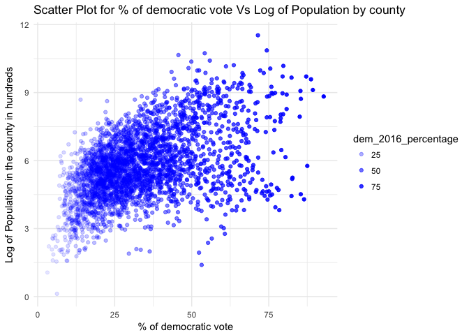
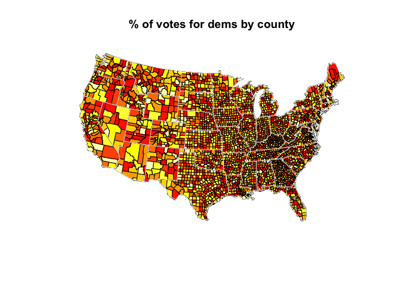
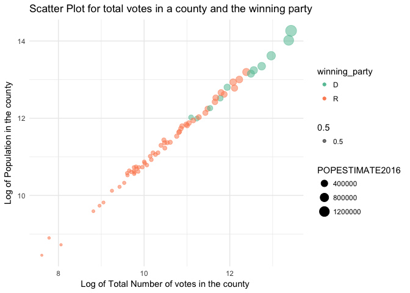
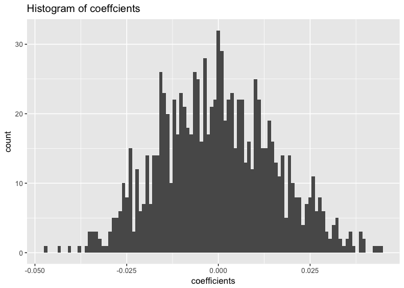

Problem 1: 2016 Election Data Results
-------------------------------------

I have analyzed the US 2016 election results by county.
US\_County\_Level\_Presidential\_Results\_08-16.csv.bz2
county\_data.csv.bz2

    #Read the data
    US_Presidential_Results_Original <- read.csv("/Users/gowriramaprasad/Downloads/US_County_Level_Presidential_Results_08-16.csv.bz2")
    US_Presidential_Results <- US_Presidential_Results_Original
    county_data_Original <- read.csv("/Users/gowriramaprasad/Downloads/county_data.csv.bz2")
    county_data <- county_data_Original

I have tided the data. I have also merged these datasets, I have
retained only interesting variables, computed additional variables I
found interesting, and given more descriptive names.

    #Load Libraries 
    library("dplyr")

    ## 
    ## Attaching package: 'dplyr'

    ## The following objects are masked from 'package:stats':
    ## 
    ##     filter, lag

    ## The following objects are masked from 'package:base':
    ## 
    ##     intersect, setdiff, setequal, union

    library("tidyr")
    library("ggplot2")

    #Explore the dataset 
    str(US_Presidential_Results)

    ## 'data.frame':    3112 obs. of  14 variables:
    ##  $ fips_code : int  26041 48295 1127 48389 56017 20043 37183 37147 48497 21207 ...
    ##  $ county    : Factor w/ 1845 levels "Abbeville County",..: 468 973 1728 1381 779 495 1725 1306 1809 1432 ...
    ##  $ total_2008: int  19064 1256 28652 3077 2546 3564 442245 74884 20639 7475 ...
    ##  $ dem_2008  : int  9974 155 7420 1606 619 1115 250891 40501 4471 1569 ...
    ##  $ gop_2008  : int  8763 1093 20722 1445 1834 2372 187001 33927 15973 5779 ...
    ##  $ oth_2008  : int  327 8 510 26 93 77 4353 456 195 127 ...
    ##  $ total_2012: int  18043 1168 28497 2867 2495 3369 526805 76814 20692 7907 ...
    ##  $ dem_2012  : int  8330 119 6551 1649 523 885 286939 40701 3219 1445 ...
    ##  $ gop_2012  : int  9533 1044 21633 1185 1894 2397 232933 35534 17178 6346 ...
    ##  $ oth_2012  : int  180 5 313 33 78 87 6933 579 295 116 ...
    ##  $ total_2016: int  18467 1322 29243 3184 2535 3366 510940 78264 24661 8171 ...
    ##  $ dem_2016  : int  6431 135 4486 1659 400 584 298353 40967 3412 1093 ...
    ##  $ gop_2016  : int  11112 1159 24208 1417 1939 2601 193607 35191 20655 6863 ...
    ##  $ oth_2016  : int  924 28 549 108 196 181 18980 2106 594 215 ...

    head(US_Presidential_Results)

    ##   fips_code             county total_2008 dem_2008 gop_2008 oth_2008
    ## 1     26041       Delta County      19064     9974     8763      327
    ## 2     48295    Lipscomb County       1256      155     1093        8
    ## 3      1127      Walker County      28652     7420    20722      510
    ## 4     48389      Reeves County       3077     1606     1445       26
    ## 5     56017 Hot Springs County       2546      619     1834       93
    ## 6     20043    Doniphan County       3564     1115     2372       77
    ##   total_2012 dem_2012 gop_2012 oth_2012 total_2016 dem_2016 gop_2016
    ## 1      18043     8330     9533      180      18467     6431    11112
    ## 2       1168      119     1044        5       1322      135     1159
    ## 3      28497     6551    21633      313      29243     4486    24208
    ## 4       2867     1649     1185       33       3184     1659     1417
    ## 5       2495      523     1894       78       2535      400     1939
    ## 6       3369      885     2397       87       3366      584     2601
    ##   oth_2016
    ## 1      924
    ## 2       28
    ## 3      549
    ## 4      108
    ## 5      196
    ## 6      181

    tail(US_Presidential_Results)

    ##      fips_code        county total_2008 dem_2008 gop_2008 oth_2008
    ## 3107     17143 Peoria County      81704    45906    34579     1219
    ## 3108     17115  Macon County      51216    25487    24948      781
    ## 3109     29215  Texas County      10851     3410     7215      226
    ## 3110     46051  Grant County       3830     1786     1951       93
    ## 3111     17103    Lee County      16318     7765     8258      295
    ## 3112     20063   Gove County       1418      261     1136       21
    ##      total_2012 dem_2012 gop_2012 oth_2012 total_2016 dem_2016 gop_2016
    ## 3107      78060    40050    36617     1393      77465    37436    35299
    ## 3108      48742    22688    25249      805      47283    18211    26782
    ## 3109      10764     2871     7618      275      10935     1728     8875
    ## 3110       3606     1493     2034       79       3562      970     2381
    ## 3111      15275     6932     8046      297      15215     5499     8597
    ## 3112       1368      174     1155       39       1328      149     1127
    ##      oth_2016
    ## 3107     4730
    ## 3108     2290
    ## 3109      332
    ## 3110      211
    ## 3111     1119
    ## 3112       52

    str(county_data)

    ## 'data.frame':    3193 obs. of  116 variables:
    ##  $ SUMLEV               : int  40 50 50 50 50 50 50 50 50 50 ...
    ##  $ REGION               : int  3 3 3 3 3 3 3 3 3 3 ...
    ##  $ DIVISION             : int  6 6 6 6 6 6 6 6 6 6 ...
    ##  $ STATE                : int  1 1 1 1 1 1 1 1 1 1 ...
    ##  $ COUNTY               : int  0 1 3 5 7 9 11 13 15 17 ...
    ##  $ STNAME               : Factor w/ 51 levels "Alabama","Alaska",..: 1 1 1 1 1 1 1 1 1 1 ...
    ##  $ CTYNAME              : Factor w/ 1927 levels "Abbeville County",..: 10 87 94 105 154 169 230 240 253 302 ...
    ##  $ CENSUS2010POP        : int  4779736 54571 182265 27457 22915 57322 10914 20947 118572 34215 ...
    ##  $ ESTIMATESBASE2010    : int  4780131 54571 182265 27457 22919 57324 10911 20946 118586 34170 ...
    ##  $ POPESTIMATE2010      : int  4785492 54742 183199 27348 22861 57376 10892 20938 118468 34101 ...
    ##  $ POPESTIMATE2011      : int  4799918 55255 186653 27326 22736 57707 10722 20848 117736 34006 ...
    ##  $ POPESTIMATE2012      : int  4815960 55027 190403 27132 22645 57772 10654 20665 117208 34084 ...
    ##  $ POPESTIMATE2013      : int  4829479 54792 195147 26938 22501 57746 10576 20330 116475 34123 ...
    ##  $ POPESTIMATE2014      : int  4843214 54977 199745 26763 22511 57621 10712 20283 115837 33996 ...
    ##  $ POPESTIMATE2015      : int  4853875 55035 203690 26270 22561 57676 10455 20126 115285 34043 ...
    ##  $ POPESTIMATE2016      : int  4863300 55416 208563 25965 22643 57704 10362 19998 114611 33843 ...
    ##  $ NPOPCHG_2010         : int  5361 171 934 -109 -58 52 -19 -8 -118 -69 ...
    ##  $ NPOPCHG_2011         : int  14426 513 3454 -22 -125 331 -170 -90 -732 -95 ...
    ##  $ NPOPCHG_2012         : int  16042 -228 3750 -194 -91 65 -68 -183 -528 78 ...
    ##  $ NPOPCHG_2013         : int  13519 -235 4744 -194 -144 -26 -78 -335 -733 39 ...
    ##  $ NPOPCHG_2014         : int  13735 185 4598 -175 10 -125 136 -47 -638 -127 ...
    ##  $ NPOPCHG_2015         : int  10661 58 3945 -493 50 55 -257 -157 -552 47 ...
    ##  $ NPOPCHG_2016         : int  9425 381 4873 -305 82 28 -93 -128 -674 -200 ...
    ##  $ BIRTHS2010           : int  14231 151 516 70 44 183 39 65 318 81 ...
    ##  $ BIRTHS2011           : int  59689 636 2188 335 266 744 169 276 1384 401 ...
    ##  $ BIRTHS2012           : int  59066 614 2092 300 245 711 122 241 1357 393 ...
    ##  $ BIRTHS2013           : int  57939 574 2161 283 258 646 131 240 1309 406 ...
    ##  $ BIRTHS2014           : int  58906 640 2214 265 254 620 124 250 1317 425 ...
    ##  $ BIRTHS2015           : int  59034 636 2237 258 259 689 115 248 1289 423 ...
    ##  $ BIRTHS2016           : int  58556 631 2274 253 266 663 114 236 1237 419 ...
    ##  $ DEATHS2010           : int  11086 154 532 128 34 132 52 60 313 80 ...
    ##  $ DEATHS2011           : int  48817 507 1825 318 277 568 132 261 1326 441 ...
    ##  $ DEATHS2012           : int  48372 560 1882 293 239 593 117 272 1357 475 ...
    ##  $ DEATHS2013           : int  50845 582 1903 295 281 584 120 261 1411 452 ...
    ##  $ DEATHS2014           : int  49693 575 1989 313 250 587 115 288 1392 454 ...
    ##  $ DEATHS2015           : int  51407 475 2080 319 207 634 108 268 1427 465 ...
    ##  $ DEATHS2016           : int  52405 494 2113 314 237 622 111 241 1441 476 ...
    ##  $ NATURALINC2010       : int  3145 -3 -16 -58 10 51 -13 5 5 1 ...
    ##  $ NATURALINC2011       : int  10872 129 363 17 -11 176 37 15 58 -40 ...
    ##  $ NATURALINC2012       : int  10694 54 210 7 6 118 5 -31 0 -82 ...
    ##  $ NATURALINC2013       : int  7094 -8 258 -12 -23 62 11 -21 -102 -46 ...
    ##  $ NATURALINC2014       : int  9213 65 225 -48 4 33 9 -38 -75 -29 ...
    ##  $ NATURALINC2015       : int  7627 161 157 -61 52 55 7 -20 -138 -42 ...
    ##  $ NATURALINC2016       : int  6151 137 161 -61 29 41 3 -5 -204 -57 ...
    ##  $ INTERNATIONALMIG2010 : int  1360 33 66 2 2 5 7 0 6 7 ...
    ##  $ INTERNATIONALMIG2011 : int  4816 18 183 -4 10 -3 19 2 39 31 ...
    ##  $ INTERNATIONALMIG2012 : int  4695 2 176 -10 13 18 16 5 63 19 ...
    ##  $ INTERNATIONALMIG2013 : int  4179 2 209 -9 13 29 9 7 26 17 ...
    ##  $ INTERNATIONALMIG2014 : int  4732 6 239 -8 18 32 10 8 24 19 ...
    ##  $ INTERNATIONALMIG2015 : int  5110 8 257 -6 18 36 9 8 29 18 ...
    ##  $ INTERNATIONALMIG2016 : int  4738 7 243 -5 18 38 9 8 27 18 ...
    ##  $ DOMESTICMIG2010      : int  866 134 867 -54 -69 -3 -13 -11 -124 -71 ...
    ##  $ DOMESTICMIG2011      : int  -1416 321 2731 -31 -123 104 -242 -105 -788 -85 ...
    ##  $ DOMESTICMIG2012      : int  414 -294 3333 -192 -111 -67 -90 -160 -591 138 ...
    ##  $ DOMESTICMIG2013      : int  1619 -253 4178 -190 -148 -94 -92 -312 -647 70 ...
    ##  $ DOMESTICMIG2014      : int  420 118 3759 -113 2 -161 117 -8 -518 -117 ...
    ##  $ DOMESTICMIG2015      : int  -3114 -154 3492 -440 2 -81 -280 -150 -457 49 ...
    ##  $ DOMESTICMIG2016      : int  -864 228 4046 -248 34 -65 -101 -127 -462 -155 ...
    ##  $ NETMIG2010           : int  2226 167 933 -52 -67 2 -6 -11 -118 -64 ...
    ##  $ NETMIG2011           : int  3400 339 2914 -35 -113 101 -223 -103 -749 -54 ...
    ##  $ NETMIG2012           : int  5109 -292 3509 -202 -98 -49 -74 -155 -528 157 ...
    ##  $ NETMIG2013           : int  5798 -251 4387 -199 -135 -65 -83 -305 -621 87 ...
    ##  $ NETMIG2014           : int  5152 124 3998 -121 20 -129 127 0 -494 -98 ...
    ##  $ NETMIG2015           : int  1996 -146 3749 -446 20 -45 -271 -142 -428 67 ...
    ##  $ NETMIG2016           : int  3874 235 4289 -253 52 -27 -92 -119 -435 -137 ...
    ##  $ RESIDUAL2010         : int  -10 7 17 1 -1 -1 0 -2 -5 -6 ...
    ##  $ RESIDUAL2011         : int  154 45 177 -4 -1 54 16 -2 -41 -1 ...
    ##  $ RESIDUAL2012         : int  239 10 31 1 1 -4 1 3 0 3 ...
    ##  $ RESIDUAL2013         : int  627 24 99 17 14 -23 -6 -9 -10 -2 ...
    ##  $ RESIDUAL2014         : int  -630 -4 375 -6 -14 -29 0 -9 -69 0 ...
    ##  $ RESIDUAL2015         : int  1038 43 39 14 -22 45 7 5 14 22 ...
    ##  $ RESIDUAL2016         : int  -600 9 423 9 1 14 -4 -4 -35 -6 ...
    ##  $ GQESTIMATESBASE2010  : int  116185 455 2307 3193 2224 489 1690 333 2933 458 ...
    ##  $ GQESTIMATES2010      : int  116214 455 2307 3193 2224 489 1690 333 2934 458 ...
    ##  $ GQESTIMATES2011      : int  115521 455 2263 3379 2224 489 1690 333 2883 458 ...
    ##  $ GQESTIMATES2012      : int  115697 455 2242 3388 2225 489 1776 333 2959 458 ...
    ##  $ GQESTIMATES2013      : int  116984 455 2296 3388 2224 489 1717 333 2813 458 ...
    ##  $ GQESTIMATES2014      : int  119189 455 2333 3352 2241 489 1758 333 2796 458 ...
    ##  $ GQESTIMATES2015      : int  120174 455 2339 3198 2255 489 1656 333 2773 458 ...
    ##  $ GQESTIMATES2016      : int  119659 455 2341 3186 2252 489 1653 333 2776 458 ...
    ##  $ RBIRTH2011           : num  12.5 11.6 11.8 12.3 11.7 ...
    ##  $ RBIRTH2012           : num  12.3 11.1 11.1 11 10.8 ...
    ##  $ RBIRTH2013           : num  12 10.5 11.2 10.5 11.4 ...
    ##  $ RBIRTH2014           : num  12.18 11.66 11.21 9.87 11.29 ...
    ##  $ RBIRTH2015           : num  12.18 11.56 11.09 9.73 11.49 ...
    ##  $ RBIRTH2016           : num  12.05 11.43 11.03 9.69 11.77 ...
    ##  $ RDEATH2011           : num  10.19 9.22 9.87 11.63 12.15 ...
    ##  $ RDEATH2012           : num  10.06 10.16 9.98 10.76 10.53 ...
    ##  $ RDEATH2013           : num  10.54 10.6 9.87 10.91 12.45 ...
    ##  $ RDEATH2014           : num  10.3 10.5 10.1 11.7 11.1 ...
    ##  $ RDEATH2015           : num  10.6 8.64 10.31 12.03 9.19 ...
    ##  $ RDEATH2016           : num  10.79 8.95 10.25 12.02 10.49 ...
    ##  $ RNATURALINC2011      : num  2.268 2.346 1.963 0.622 -0.482 ...
    ##  $ RNATURALINC2012      : num  2.224 0.979 1.114 0.257 0.264 ...
    ##  $ RNATURALINC2013      : num  1.471 -0.146 1.338 -0.444 -1.019 ...
    ##  $ RNATURALINC2014      : num  1.905 1.184 1.14 -1.788 0.178 ...
    ##  $ RNATURALINC2015      : num  1.573 2.927 0.778 -2.3 2.307 ...
    ##  $ RNATURALINC2016      : num  1.266 2.481 0.781 -2.336 1.283 ...
    ##  $ RINTERNATIONALMIG2011: num  1.005 0.327 0.99 -0.146 0.439 ...
    ##   [list output truncated]

    head(county_data)

    ##   SUMLEV REGION DIVISION STATE COUNTY  STNAME        CTYNAME CENSUS2010POP
    ## 1     40      3        6     1      0 Alabama        Alabama       4779736
    ## 2     50      3        6     1      1 Alabama Autauga County         54571
    ## 3     50      3        6     1      3 Alabama Baldwin County        182265
    ## 4     50      3        6     1      5 Alabama Barbour County         27457
    ## 5     50      3        6     1      7 Alabama    Bibb County         22915
    ## 6     50      3        6     1      9 Alabama  Blount County         57322
    ##   ESTIMATESBASE2010 POPESTIMATE2010 POPESTIMATE2011 POPESTIMATE2012
    ## 1           4780131         4785492         4799918         4815960
    ## 2             54571           54742           55255           55027
    ## 3            182265          183199          186653          190403
    ## 4             27457           27348           27326           27132
    ## 5             22919           22861           22736           22645
    ## 6             57324           57376           57707           57772
    ##   POPESTIMATE2013 POPESTIMATE2014 POPESTIMATE2015 POPESTIMATE2016
    ## 1         4829479         4843214         4853875         4863300
    ## 2           54792           54977           55035           55416
    ## 3          195147          199745          203690          208563
    ## 4           26938           26763           26270           25965
    ## 5           22501           22511           22561           22643
    ## 6           57746           57621           57676           57704
    ##   NPOPCHG_2010 NPOPCHG_2011 NPOPCHG_2012 NPOPCHG_2013 NPOPCHG_2014
    ## 1         5361        14426        16042        13519        13735
    ## 2          171          513         -228         -235          185
    ## 3          934         3454         3750         4744         4598
    ## 4         -109          -22         -194         -194         -175
    ## 5          -58         -125          -91         -144           10
    ## 6           52          331           65          -26         -125
    ##   NPOPCHG_2015 NPOPCHG_2016 BIRTHS2010 BIRTHS2011 BIRTHS2012 BIRTHS2013
    ## 1        10661         9425      14231      59689      59066      57939
    ## 2           58          381        151        636        614        574
    ## 3         3945         4873        516       2188       2092       2161
    ## 4         -493         -305         70        335        300        283
    ## 5           50           82         44        266        245        258
    ## 6           55           28        183        744        711        646
    ##   BIRTHS2014 BIRTHS2015 BIRTHS2016 DEATHS2010 DEATHS2011 DEATHS2012
    ## 1      58906      59034      58556      11086      48817      48372
    ## 2        640        636        631        154        507        560
    ## 3       2214       2237       2274        532       1825       1882
    ## 4        265        258        253        128        318        293
    ## 5        254        259        266         34        277        239
    ## 6        620        689        663        132        568        593
    ##   DEATHS2013 DEATHS2014 DEATHS2015 DEATHS2016 NATURALINC2010
    ## 1      50845      49693      51407      52405           3145
    ## 2        582        575        475        494             -3
    ## 3       1903       1989       2080       2113            -16
    ## 4        295        313        319        314            -58
    ## 5        281        250        207        237             10
    ## 6        584        587        634        622             51
    ##   NATURALINC2011 NATURALINC2012 NATURALINC2013 NATURALINC2014
    ## 1          10872          10694           7094           9213
    ## 2            129             54             -8             65
    ## 3            363            210            258            225
    ## 4             17              7            -12            -48
    ## 5            -11              6            -23              4
    ## 6            176            118             62             33
    ##   NATURALINC2015 NATURALINC2016 INTERNATIONALMIG2010 INTERNATIONALMIG2011
    ## 1           7627           6151                 1360                 4816
    ## 2            161            137                   33                   18
    ## 3            157            161                   66                  183
    ## 4            -61            -61                    2                   -4
    ## 5             52             29                    2                   10
    ## 6             55             41                    5                   -3
    ##   INTERNATIONALMIG2012 INTERNATIONALMIG2013 INTERNATIONALMIG2014
    ## 1                 4695                 4179                 4732
    ## 2                    2                    2                    6
    ## 3                  176                  209                  239
    ## 4                  -10                   -9                   -8
    ## 5                   13                   13                   18
    ## 6                   18                   29                   32
    ##   INTERNATIONALMIG2015 INTERNATIONALMIG2016 DOMESTICMIG2010
    ## 1                 5110                 4738             866
    ## 2                    8                    7             134
    ## 3                  257                  243             867
    ## 4                   -6                   -5             -54
    ## 5                   18                   18             -69
    ## 6                   36                   38              -3
    ##   DOMESTICMIG2011 DOMESTICMIG2012 DOMESTICMIG2013 DOMESTICMIG2014
    ## 1           -1416             414            1619             420
    ## 2             321            -294            -253             118
    ## 3            2731            3333            4178            3759
    ## 4             -31            -192            -190            -113
    ## 5            -123            -111            -148               2
    ## 6             104             -67             -94            -161
    ##   DOMESTICMIG2015 DOMESTICMIG2016 NETMIG2010 NETMIG2011 NETMIG2012
    ## 1           -3114            -864       2226       3400       5109
    ## 2            -154             228        167        339       -292
    ## 3            3492            4046        933       2914       3509
    ## 4            -440            -248        -52        -35       -202
    ## 5               2              34        -67       -113        -98
    ## 6             -81             -65          2        101        -49
    ##   NETMIG2013 NETMIG2014 NETMIG2015 NETMIG2016 RESIDUAL2010 RESIDUAL2011
    ## 1       5798       5152       1996       3874          -10          154
    ## 2       -251        124       -146        235            7           45
    ## 3       4387       3998       3749       4289           17          177
    ## 4       -199       -121       -446       -253            1           -4
    ## 5       -135         20         20         52           -1           -1
    ## 6        -65       -129        -45        -27           -1           54
    ##   RESIDUAL2012 RESIDUAL2013 RESIDUAL2014 RESIDUAL2015 RESIDUAL2016
    ## 1          239          627         -630         1038         -600
    ## 2           10           24           -4           43            9
    ## 3           31           99          375           39          423
    ## 4            1           17           -6           14            9
    ## 5            1           14          -14          -22            1
    ## 6           -4          -23          -29           45           14
    ##   GQESTIMATESBASE2010 GQESTIMATES2010 GQESTIMATES2011 GQESTIMATES2012
    ## 1              116185          116214          115521          115697
    ## 2                 455             455             455             455
    ## 3                2307            2307            2263            2242
    ## 4                3193            3193            3379            3388
    ## 5                2224            2224            2224            2225
    ## 6                 489             489             489             489
    ##   GQESTIMATES2013 GQESTIMATES2014 GQESTIMATES2015 GQESTIMATES2016
    ## 1          116984          119189          120174          119659
    ## 2             455             455             455             455
    ## 3            2296            2333            2339            2341
    ## 4            3388            3352            3198            3186
    ## 5            2224            2241            2255            2252
    ## 6             489             489             489             489
    ##   RBIRTH2011 RBIRTH2012 RBIRTH2013 RBIRTH2014 RBIRTH2015 RBIRTH2016
    ## 1   12.45414   12.28510   12.01376  12.179855  12.175613  12.052062
    ## 2   11.56395   11.13509   10.45356  11.660851  11.562375  11.425881
    ## 3   11.83176   11.09649   11.20996  11.213192  11.089767  11.032060
    ## 4   12.25445   11.01766   10.46791   9.869462   9.729791   9.686991
    ## 5   11.66743   10.79747   11.42958  11.285879  11.492723  11.768870
    ## 6   12.92980   12.31393   11.18440  10.748308  11.951742  11.492460
    ##   RDEATH2011 RDEATH2012 RDEATH2013 RDEATH2014 RDEATH2015 RDEATH2016
    ## 1  10.185688  10.060860  10.542807   10.27490  10.602563  10.786057
    ## 2   9.218433  10.155782  10.599259   10.47655   8.635422   8.945143
    ## 3   9.868812   9.982602   9.871612   10.07364  10.311450  10.250987
    ## 4  11.632586  10.760586  10.911781   11.65714  12.030245  12.022590
    ## 5  12.149922  10.533042  12.448500   11.10815   9.185304  10.485798
    ## 6   9.871136  10.270266  10.110978   10.17622  10.997684  10.781765
    ##   RNATURALINC2011 RNATURALINC2012 RNATURALINC2013 RNATURALINC2014
    ## 1       2.2684476       2.2242379       1.4709543       1.9049504
    ## 2       2.3455185       0.9793076      -0.1456943       1.1843052
    ## 3       1.9629473       1.1138929       1.3383478       1.1395521
    ## 4       0.6218678       0.2570788      -0.4438691      -1.7876762
    ## 5      -0.4824879       0.2644278      -1.0189164       0.1777304
    ## 6       3.0586620       2.0436616       1.0734258       0.5720873
    ##   RNATURALINC2015 RNATURALINC2016 RINTERNATIONALMIG2011
    ## 1       1.5730494       1.2660058            1.00486051
    ## 2       2.9269534       2.4807381            0.32728165
    ## 3       0.7783162       0.7810738            0.98958502
    ## 4      -2.3004544      -2.3355987           -0.14632184
    ## 5       2.3074192       1.2830723            0.43862535
    ## 6       0.9540578       0.7106951           -0.05213628
    ##   RINTERNATIONALMIG2012 RINTERNATIONALMIG2013 RINTERNATIONALMIG2014
    ## 1            0.97650989            0.86652355             0.9784245
    ## 2            0.03627065            0.03642357             0.1093205
    ## 3            0.93354833            1.08416548             1.2104575
    ## 4           -0.36725550           -0.33290179            -0.2979460
    ## 5            0.57292700            0.57590927             0.7997867
    ## 6            0.31174499            0.50208626             0.5547514
    ##   RINTERNATIONALMIG2015 RINTERNATIONALMIG2016 RDOMESTICMIG2011
    ## 1             1.0539245             0.9751805        -0.295449
    ## 2             0.1454387             0.1267530         5.836523
    ## 3             1.2740590             1.1788877        14.768069
    ## 4            -0.2262742            -0.1914425        -1.133994
    ## 5             0.7987220             0.7963897        -5.395092
    ## 6             0.6244742             0.6586930         1.807391
    ##   RDOMESTICMIG2012 RDOMESTICMIG2013 RDOMESTICMIG2014 RDOMESTICMIG2015
    ## 1       0.08610758        0.3357027       0.08684241      -0.64225460
    ## 2      -5.33178579       -4.6075816       2.14996948      -2.79969458
    ## 3      17.67907154       21.6729348      19.03811675      17.31133888
    ## 4      -7.05130559       -7.0279268      -4.20848774     -16.59344182
    ## 5      -4.89191512       -6.5565056       0.08886519       0.08874689
    ## 6      -1.16038414       -1.6274520      -2.79109277      -1.40506691
    ##   RDOMESTICMIG2016 RNETMIG2011 RNETMIG2012 RNETMIG2013 RNETMIG2014
    ## 1       -0.1778295   0.7094115   1.0626175    1.202226   1.0652669
    ## 2        4.1285276   6.1638045  -5.2955151   -4.571158   2.2592900
    ## 3       19.6287231  15.7576544  18.6126199   22.757100  20.2485743
    ## 4       -9.4955490  -1.2803161  -7.4185611   -7.360829  -4.5064338
    ## 5        1.5042917  -4.9564664  -4.3189881   -5.980596   0.8886519
    ## 6       -1.1267117   1.7552549  -0.8486391   -1.125366  -2.2363414
    ##   RNETMIG2015 RNETMIG2016
    ## 1   0.4116699   0.7973511
    ## 2  -2.6542559   4.2552806
    ## 3  18.5853979  20.8076109
    ## 4 -16.8197160  -9.6869915
    ## 5   0.8874689   2.3006814
    ## 6  -0.7805927  -0.4680187

    tail(county_data)

    ##      SUMLEV REGION DIVISION STATE COUNTY  STNAME           CTYNAME
    ## 3188     50      4        8    56     35 Wyoming   Sublette County
    ## 3189     50      4        8    56     37 Wyoming Sweetwater County
    ## 3190     50      4        8    56     39 Wyoming      Teton County
    ## 3191     50      4        8    56     41 Wyoming      Uinta County
    ## 3192     50      4        8    56     43 Wyoming   Washakie County
    ## 3193     50      4        8    56     45 Wyoming     Weston County
    ##      CENSUS2010POP ESTIMATESBASE2010 POPESTIMATE2010 POPESTIMATE2011
    ## 3188         10247             10247           10243           10145
    ## 3189         43806             43806           43589           44028
    ## 3190         21294             21294           21297           21474
    ## 3191         21118             21118           21102           20918
    ## 3192          8533              8533            8544            8470
    ## 3193          7208              7208            7182            7112
    ##      POPESTIMATE2012 POPESTIMATE2013 POPESTIMATE2014 POPESTIMATE2015
    ## 3188           10414           10082           10019            9877
    ## 3189           45086           45144           44970           44693
    ## 3190           21688           22319           22846           23073
    ## 3191           20997           21006           20871           20819
    ## 3192            8437            8442            8306            8334
    ## 3193            7065            7163            7179            7230
    ##      POPESTIMATE2016 NPOPCHG_2010 NPOPCHG_2011 NPOPCHG_2012 NPOPCHG_2013
    ## 3188            9769           -4          -98          269         -332
    ## 3189           44165         -217          439         1058           58
    ## 3190           23191            3          177          214          631
    ## 3191           20773          -16         -184           79            9
    ## 3192            8235           11          -74          -33            5
    ## 3193            7236          -26          -70          -47           98
    ##      NPOPCHG_2014 NPOPCHG_2015 NPOPCHG_2016 BIRTHS2010 BIRTHS2011
    ## 3188          -63         -142         -108         34        135
    ## 3189         -174         -277         -528        167        641
    ## 3190          527          227          118         76        260
    ## 3191         -135          -52          -46         72        324
    ## 3192         -136           28          -99         26        108
    ## 3193           16           51            6         26         81
    ##      BIRTHS2012 BIRTHS2013 BIRTHS2014 BIRTHS2015 BIRTHS2016 DEATHS2010
    ## 3188        138        132        123        119        118          3
    ## 3189        595        657        630        621        604         76
    ## 3190        231        261        243        243        239         10
    ## 3191        311        316        323        311        309         49
    ## 3192         90         95         89        105         98         34
    ## 3193         74         93         74         72         67          9
    ##      DEATHS2011 DEATHS2012 DEATHS2013 DEATHS2014 DEATHS2015 DEATHS2016
    ## 3188         53         38         48         57         49         58
    ## 3189        251        272        296        265        265        275
    ## 3190         87         61         97         79         79         87
    ## 3191        139        115        136        148        121        134
    ## 3192         79        105         77         73         92         93
    ## 3193         71         67         77         75         71         77
    ##      NATURALINC2010 NATURALINC2011 NATURALINC2012 NATURALINC2013
    ## 3188             31             82            100             84
    ## 3189             91            390            323            361
    ## 3190             66            173            170            164
    ## 3191             23            185            196            180
    ## 3192             -8             29            -15             18
    ## 3193             17             10              7             16
    ##      NATURALINC2014 NATURALINC2015 NATURALINC2016 INTERNATIONALMIG2010
    ## 3188             66             70             60                    3
    ## 3189            365            356            329                    5
    ## 3190            164            164            152                    5
    ## 3191            175            190            175                    2
    ## 3192             16             13              5                    1
    ## 3193             -1              1            -10                    1
    ##      INTERNATIONALMIG2011 INTERNATIONALMIG2012 INTERNATIONALMIG2013
    ## 3188                   27                   19                    1
    ## 3189                    6                   -3                    5
    ## 3190                   48                   27                   31
    ## 3191                   -9                  -13                  -18
    ## 3192                   -3                   -2                   -4
    ## 3193                   -2                    3                    4
    ##      INTERNATIONALMIG2014 INTERNATIONALMIG2015 INTERNATIONALMIG2016
    ## 3188                    1                    2                    2
    ## 3189                    6                   10                   10
    ## 3190                   41                   49                   48
    ## 3191                  -16                  -15                  -14
    ## 3192                   -4                   -4                   -4
    ## 3193                    3                    4                    4
    ##      DOMESTICMIG2010 DOMESTICMIG2011 DOMESTICMIG2012 DOMESTICMIG2013
    ## 3188             -36            -240             147            -406
    ## 3189            -328              38             719            -244
    ## 3190             -70             -40              22             416
    ## 3191             -44            -363            -101            -165
    ## 3192              19             -98             -16             -10
    ## 3193             -40             -87             -57              87
    ##      DOMESTICMIG2014 DOMESTICMIG2015 DOMESTICMIG2016 NETMIG2010 NETMIG2011
    ## 3188            -148            -200            -182        -33       -213
    ## 3189            -557            -614            -889       -323         44
    ## 3190             314              24            -109        -65          8
    ## 3191            -297            -230            -203        -42       -372
    ## 3192            -145              22             -95         20       -101
    ## 3193              11              44              16        -39        -89
    ##      NETMIG2012 NETMIG2013 NETMIG2014 NETMIG2015 NETMIG2016 RESIDUAL2010
    ## 3188        166       -405       -147       -198       -180           -2
    ## 3189        716       -239       -551       -604       -879           15
    ## 3190         49        447        355         73        -61            2
    ## 3191       -114       -183       -313       -245       -217            3
    ## 3192        -18        -14       -149         18        -99           -1
    ## 3193        -54         91         14         48         20           -4
    ##      RESIDUAL2011 RESIDUAL2012 RESIDUAL2013 RESIDUAL2014 RESIDUAL2015
    ## 3188           33            3          -11           18          -14
    ## 3189            5           19          -64           12          -29
    ## 3190           -4           -5           20            8          -10
    ## 3191            3           -3           12            3            3
    ## 3192           -2            0            1           -3           -3
    ## 3193            9            0           -9            3            2
    ##      RESIDUAL2016 GQESTIMATESBASE2010 GQESTIMATES2010 GQESTIMATES2011
    ## 3188           12                 550             550             550
    ## 3189           22                 679             679             694
    ## 3190           27                 271             271             271
    ## 3191           -4                 270             270             247
    ## 3192           -5                 140             140             140
    ## 3193           -4                 313             313             313
    ##      GQESTIMATES2012 GQESTIMATES2013 GQESTIMATES2014 GQESTIMATES2015
    ## 3188             550             550             550             550
    ## 3189             697             731             672             682
    ## 3190             270             269             268             267
    ## 3191             243             255             254             254
    ## 3192             140             140             140             140
    ## 3193             313             322             317             327
    ##      GQESTIMATES2016 RBIRTH2011 RBIRTH2012 RBIRTH2013 RBIRTH2014
    ## 3188             550   13.24308   13.42478   12.88056   12.23820
    ## 3189             684   14.63186   13.35368   14.56278   13.98229
    ## 3190             267   12.15777   10.70386   11.86175   10.76054
    ## 3191             254   15.42123   14.83956   15.04654   15.42613
    ## 3192             140   12.69543   10.64648   11.25659   10.62813
    ## 3193             327   11.33343   10.43944   13.07281   10.31934
    ##      RBIRTH2015 RBIRTH2016 RDEATH2011 RDEATH2012 RDEATH2013 RDEATH2014
    ## 3188  11.962203   12.01262   5.199137   3.696678   4.683841   5.671360
    ## 3189  13.851868   13.59472   5.729482   6.104540   6.561011   5.881439
    ## 3190  10.583854   10.33201   4.068177   2.826560   4.408390   3.498284
    ## 3191  14.919645   14.85863   6.615897   5.487296   6.475728   7.068319
    ## 3192  12.620192   11.82932   9.286470  12.420891   9.123763   8.717459
    ## 3193   9.993754    9.26310   9.934238   9.451929  10.823728  10.458792
    ##      RDEATH2015 RDEATH2016 RNATURALINC2011 RNATURALINC2012 RNATURALINC2013
    ## 3188   4.925613   5.904510        8.043947        9.728100        8.196721
    ## 3189   5.911022   6.189651        8.902382        7.249142        8.001773
    ## 3190   3.440841   3.761024        8.089593        7.877299        7.453360
    ## 3191   5.804749   6.443547        8.805331        9.352261        8.570816
    ## 3192  11.057692  11.225783        3.408957       -1.774413        2.132828
    ## 3193   9.854952  10.645652        1.399188        0.987515        2.249086
    ##      RNATURALINC2014 RNATURALINC2015 RNATURALINC2016 RINTERNATIONALMIG2011
    ## 3188       6.5668375       7.0365903       6.1081136             2.6486168
    ## 3189       8.1008500       7.9408452       7.4050733             0.1369597
    ## 3190       7.2622606       7.1430127       6.5709839             2.2445115
    ## 3191       8.3578098       9.1148957       8.4150798            -0.4283674
    ## 3192       1.9106759       1.5625000       0.6035367            -0.3526508
    ## 3193      -0.1394506       0.1388021      -1.3825522            -0.2798377
    ##      RINTERNATIONALMIG2012 RINTERNATIONALMIG2013 RINTERNATIONALMIG2014
    ## 3188            1.84833893            0.09758002            0.09949754
    ## 3189           -0.06732949            0.11082788            0.13316466
    ## 3190            1.25110051            1.40886677            1.81556515
    ## 3191           -0.62030299           -0.85708164           -0.76414261
    ## 3192           -0.23658840           -0.47396173           -0.47766897
    ## 3193            0.42322071            0.56227158            0.41835169
    ##      RINTERNATIONALMIG2015 RINTERNATIONALMIG2016 RDOMESTICMIG2011
    ## 3188             0.2010454             0.2036038      -23.5432607
    ## 3189             0.2230574             0.2250782        0.8674116
    ## 3190             2.1341928             2.0750476       -1.8704262
    ## 3191            -0.7195970            -0.6732064      -17.2774869
    ## 3192            -0.4807692            -0.4828294      -11.5199248
    ## 3193             0.5552086             0.5530209      -12.1729397
    ##      RDOMESTICMIG2012 RDOMESTICMIG2013 RDOMESTICMIG2014 RDOMESTICMIG2015
    ## 3188        14.300306       -39.617486       -14.725636       -20.104544
    ## 3189        16.136634        -5.408401       -12.362119       -13.695727
    ## 3190         1.019415        18.906083        13.904572         1.045319
    ## 3191        -4.819277        -7.856582       -14.184397       -11.033821
    ## 3192        -1.892707        -1.184904       -17.315500         2.644231
    ## 3193        -8.041193        12.229407         1.533956         6.107294
    ##      RDOMESTICMIG2016 RNETMIG2011 RNETMIG2012 RNETMIG2013 RNETMIG2014
    ## 3188       -18.527945 -20.8946439   16.148645  -39.519906  -14.626138
    ## 3189       -20.009453   1.0043713   16.069304   -5.297573  -12.228954
    ## 3190        -4.712087   0.3740852    2.270516   20.314950   15.720137
    ## 3191        -9.761493 -17.7058544   -5.439580   -8.713663  -14.948540
    ## 3192       -11.467198 -11.8725755   -2.129296   -1.658866  -17.793169
    ## 3193         2.212084 -12.4527774   -7.617973   12.791678    1.952308
    ##      RNETMIG2015 RNETMIG2016
    ## 3188  -19.903498  -18.324341
    ## 3189  -13.472670  -19.784375
    ## 3190    3.179512   -2.637040
    ## 3191  -11.753418  -10.434699
    ## 3192    2.163462  -11.950027
    ## 3193    6.662503    2.765104

    #FIPS code examination 
    min(US_Presidential_Results$fips_code)

    ## [1] 1001

    max(US_Presidential_Results$fips_code)

    ## [1] 56045

    length(unique(US_Presidential_Results$fips_code))

    ## [1] 3112

From an intial exploratory analysis of the data specifically the FIPS
codes the following can be concluded:

1.  The FIPS code in the
    US\_County\_Level\_Presidential\_Results\_08-16.csv.bz2 is a
    combination of 2-digit state codes and 3-digit county codes. This
    data is available in the county\_data.csv.bz2 as STATE and COUNTY
    columns.
2.  We can generate FIPS code in the county\_data.csv.bz2 by merging
    these two columns
3.  Then, we can merge the dataset based on these codes To ensure there
    is no data loss, I want to do a full join and then filter out the
    initial data.

<!-- -->

    #Generate FIPS codes for county_data.csv.bz2 
    county_data$fips_code <- county_data$STATE*1000+county_data$COUNTY
    min(county_data$fips_code)

    ## [1] 1000

    max(county_data$fips_code)

    ## [1] 56045

    length(unique(county_data$fips_code))

    ## [1] 3193

Here we notice, that the number of unique values is 3193 and has more
rows than the US\_presidential\_Election data (3112). I have made a
decision to do an left join to merge these tables, since if the county's
election results are not recorded it will be of no use to my analysis.

    #Merge the dataset on FIPS codes 
    US_election_data_merged <- left_join(US_Presidential_Results,county_data, by = "fips_code")
    str(US_election_data_merged)

    ## 'data.frame':    3112 obs. of  130 variables:
    ##  $ fips_code            : num  26041 48295 1127 48389 56017 ...
    ##  $ county               : Factor w/ 1845 levels "Abbeville County",..: 468 973 1728 1381 779 495 1725 1306 1809 1432 ...
    ##  $ total_2008           : int  19064 1256 28652 3077 2546 3564 442245 74884 20639 7475 ...
    ##  $ dem_2008             : int  9974 155 7420 1606 619 1115 250891 40501 4471 1569 ...
    ##  $ gop_2008             : int  8763 1093 20722 1445 1834 2372 187001 33927 15973 5779 ...
    ##  $ oth_2008             : int  327 8 510 26 93 77 4353 456 195 127 ...
    ##  $ total_2012           : int  18043 1168 28497 2867 2495 3369 526805 76814 20692 7907 ...
    ##  $ dem_2012             : int  8330 119 6551 1649 523 885 286939 40701 3219 1445 ...
    ##  $ gop_2012             : int  9533 1044 21633 1185 1894 2397 232933 35534 17178 6346 ...
    ##  $ oth_2012             : int  180 5 313 33 78 87 6933 579 295 116 ...
    ##  $ total_2016           : int  18467 1322 29243 3184 2535 3366 510940 78264 24661 8171 ...
    ##  $ dem_2016             : int  6431 135 4486 1659 400 584 298353 40967 3412 1093 ...
    ##  $ gop_2016             : int  11112 1159 24208 1417 1939 2601 193607 35191 20655 6863 ...
    ##  $ oth_2016             : int  924 28 549 108 196 181 18980 2106 594 215 ...
    ##  $ SUMLEV               : int  50 50 50 50 50 50 50 50 50 50 ...
    ##  $ REGION               : int  2 3 3 3 4 2 3 3 3 3 ...
    ##  $ DIVISION             : int  3 7 6 7 8 4 5 5 7 6 ...
    ##  $ STATE                : int  26 48 1 48 56 20 37 37 48 21 ...
    ##  $ COUNTY               : int  41 295 127 389 17 43 183 147 497 207 ...
    ##  $ STNAME               : Factor w/ 51 levels "Alabama","Alaska",..: 23 44 1 44 51 17 34 34 44 18 ...
    ##  $ CTYNAME              : Factor w/ 1927 levels "Abbeville County",..: 481 1008 1803 1444 800 510 1800 1368 1887 1496 ...
    ##  $ CENSUS2010POP        : int  37069 3302 67023 13783 4812 7945 900993 168148 59127 17565 ...
    ##  $ ESTIMATESBASE2010    : int  37069 3302 67023 13783 4812 7945 901037 168152 59110 17568 ...
    ##  $ POPESTIMATE2010      : int  37066 3284 67006 13815 4813 7948 906949 168825 59100 17558 ...
    ##  $ POPESTIMATE2011      : int  36935 3345 66661 13777 4819 7951 929208 170756 59979 17676 ...
    ##  $ POPESTIMATE2012      : int  36838 3457 66211 13925 4843 7869 952296 172913 60412 17566 ...
    ##  $ POPESTIMATE2013      : int  36830 3484 65934 14126 4840 7844 973920 174332 61025 17725 ...
    ##  $ POPESTIMATE2014      : int  36573 3555 65564 14429 4797 7833 997897 175105 61717 17770 ...
    ##  $ POPESTIMATE2015      : int  36407 3553 65291 14789 4745 7756 1021974 176182 62836 17636 ...
    ##  $ POPESTIMATE2016      : int  36202 3487 64967 14921 4679 7664 1046791 177220 64455 17722 ...
    ##  $ NPOPCHG_2010         : int  -3 -18 -17 32 1 3 5912 673 -10 -10 ...
    ##  $ NPOPCHG_2011         : int  -131 61 -345 -38 6 3 22259 1931 879 118 ...
    ##  $ NPOPCHG_2012         : int  -97 112 -450 148 24 -82 23088 2157 433 -110 ...
    ##  $ NPOPCHG_2013         : int  -8 27 -277 201 -3 -25 21624 1419 613 159 ...
    ##  $ NPOPCHG_2014         : int  -257 71 -370 303 -43 -11 23977 773 692 45 ...
    ##  $ NPOPCHG_2015         : int  -166 -2 -273 360 -52 -77 24077 1077 1119 -134 ...
    ##  $ NPOPCHG_2016         : int  -205 -66 -324 132 -66 -92 24817 1038 1619 86 ...
    ##  $ BIRTHS2010           : int  81 14 218 43 15 19 3208 544 193 60 ...
    ##  $ BIRTHS2011           : int  372 58 814 166 55 93 12542 2095 780 222 ...
    ##  $ BIRTHS2012           : int  360 35 826 153 55 84 12260 2158 724 232 ...
    ##  $ BIRTHS2013           : int  388 46 753 173 48 84 12299 2126 779 224 ...
    ##  $ BIRTHS2014           : int  374 47 807 199 52 72 12617 2138 775 189 ...
    ##  $ BIRTHS2015           : int  373 45 803 207 46 64 12803 2150 816 213 ...
    ##  $ BIRTHS2016           : int  380 45 797 211 49 61 12884 2121 810 202 ...
    ##  $ DEATHS2010           : int  113 10 244 11 19 10 1054 215 128 37 ...
    ##  $ DEATHS2011           : int  445 25 910 92 72 68 4393 1143 447 237 ...
    ##  $ DEATHS2012           : int  424 31 1027 90 57 82 4552 1186 517 224 ...
    ##  $ DEATHS2013           : int  413 32 1035 125 65 76 4785 1195 501 213 ...
    ##  $ DEATHS2014           : int  407 30 958 118 76 75 4844 1167 506 230 ...
    ##  $ DEATHS2015           : int  435 15 939 101 59 74 5262 1275 560 233 ...
    ##  $ DEATHS2016           : int  426 19 950 98 69 70 5416 1318 580 220 ...
    ##  $ NATURALINC2010       : int  -32 4 -26 32 -4 9 2154 329 65 23 ...
    ##  $ NATURALINC2011       : int  -73 33 -96 74 -17 25 8149 952 333 -15 ...
    ##  $ NATURALINC2012       : int  -64 4 -201 63 -2 2 7708 972 207 8 ...
    ##  $ NATURALINC2013       : int  -25 14 -282 48 -17 8 7514 931 278 11 ...
    ##  $ NATURALINC2014       : int  -33 17 -151 81 -24 -3 7773 971 269 -41 ...
    ##  $ NATURALINC2015       : int  -62 30 -136 106 -13 -10 7541 875 256 -20 ...
    ##  $ NATURALINC2016       : int  -46 26 -153 113 -20 -9 7468 803 230 -18 ...
    ##  $ INTERNATIONALMIG2010 : int  1 1 6 3 2 1 784 45 2 4 ...
    ##  $ INTERNATIONALMIG2011 : int  4 10 33 40 9 6 3385 223 26 14 ...
    ##  $ INTERNATIONALMIG2012 : int  4 3 34 48 0 5 3400 231 10 15 ...
    ##  $ INTERNATIONALMIG2013 : int  6 3 28 55 0 5 3440 238 16 9 ...
    ##  $ INTERNATIONALMIG2014 : int  6 5 34 65 0 7 3873 284 25 12 ...
    ##  $ INTERNATIONALMIG2015 : int  6 6 35 68 0 7 4063 288 33 14 ...
    ##  $ INTERNATIONALMIG2016 : int  6 6 35 71 0 7 3988 282 33 14 ...
    ##  $ DOMESTICMIG2010      : int  32 -24 5 0 3 -4 2862 283 -80 -33 ...
    ##  $ DOMESTICMIG2011      : int  -40 14 -295 -161 17 -24 10583 792 494 120 ...
    ##  $ DOMESTICMIG2012      : int  -36 103 -285 39 27 -87 11821 937 219 -130 ...
    ##  $ DOMESTICMIG2013      : int  -16 24 -60 105 10 -33 10370 203 307 144 ...
    ##  $ DOMESTICMIG2014      : int  -218 46 -223 149 -21 -12 11891 -468 397 87 ...
    ##  $ DOMESTICMIG2015      : int  -103 -34 -205 188 -31 -68 11833 -31 770 -108 ...
    ##  $ DOMESTICMIG2016      : int  -144 -104 -180 -48 -47 -92 13041 -25 1321 97 ...
    ##  $ NETMIG2010           : int  33 -23 11 3 5 -3 3646 328 -78 -29 ...
    ##  $ NETMIG2011           : int  -36 24 -262 -121 26 -18 13968 1015 520 134 ...
    ##  $ NETMIG2012           : int  -32 106 -251 87 27 -82 15221 1168 229 -115 ...
    ##  $ NETMIG2013           : int  -10 27 -32 160 10 -28 13810 441 323 153 ...
    ##  $ NETMIG2014           : int  -212 51 -189 214 -21 -5 15764 -184 422 99 ...
    ##  $ NETMIG2015           : int  -97 -28 -170 256 -31 -61 15896 257 803 -94 ...
    ##  $ NETMIG2016           : int  -138 -98 -145 23 -47 -85 17029 257 1354 111 ...
    ##  $ RESIDUAL2010         : int  -4 1 -2 -3 0 -3 112 16 3 -4 ...
    ##  $ RESIDUAL2011         : int  -22 4 13 9 -3 -4 142 -36 26 -1 ...
    ##  $ RESIDUAL2012         : int  -1 2 2 -2 -1 -2 159 17 -3 -3 ...
    ##  $ RESIDUAL2013         : int  27 -14 37 -7 4 -5 300 47 12 -5 ...
    ##  $ RESIDUAL2014         : int  -12 3 -30 8 2 -3 440 -14 1 -13 ...
    ##  $ RESIDUAL2015         : int  -7 -4 33 -2 -8 -6 640 -55 60 -20 ...
    ##  $ RESIDUAL2016         : int  -21 6 -26 -4 1 2 320 -22 35 -7 ...
    ##  $ GQESTIMATESBASE2010  : int  623 37 866 3110 86 427 20983 6526 980 177 ...
    ##  $ GQESTIMATES2010      : int  623 37 866 3122 86 427 20990 6528 980 177 ...
    ##  $ GQESTIMATES2011      : int  623 37 850 3119 86 427 21111 6245 981 177 ...
    ##  $ GQESTIMATES2012      : int  623 36 851 3127 86 427 21000 6667 951 177 ...
    ##  $ GQESTIMATES2013      : int  623 35 851 3132 86 427 20755 6747 978 177 ...
    ##  $ GQESTIMATES2014      : int  623 38 851 3131 86 427 21016 6474 1012 177 ...
    ##  $ GQESTIMATES2015      : int  623 40 851 3135 86 427 20828 6813 986 177 ...
    ##  $ GQESTIMATES2016      : int  623 40 851 3136 86 427 20843 6820 986 177 ...
    ##  $ RBIRTH2011           : num  10.1 17.5 12.2 12 11.4 ...
    ##  $ RBIRTH2012           : num  9.76 10.29 12.43 11.05 11.38 ...
    ##  $ RBIRTH2013           : num  10.53 13.25 11.4 12.33 9.91 ...
    ##  $ RBIRTH2014           : num  10.2 13.4 12.3 13.9 10.8 ...
    ##  $ RBIRTH2015           : num  10.22 12.66 12.27 14.17 9.64 ...
    ##   [list output truncated]

    summary(US_election_data_merged$dem_2016)

    ##    Min. 1st Qu.  Median    Mean 3rd Qu.    Max. 
    ##       4    1165    3140   19561    9535 1654626

    head(US_election_data_merged)

    ##   fips_code             county total_2008 dem_2008 gop_2008 oth_2008
    ## 1     26041       Delta County      19064     9974     8763      327
    ## 2     48295    Lipscomb County       1256      155     1093        8
    ## 3      1127      Walker County      28652     7420    20722      510
    ## 4     48389      Reeves County       3077     1606     1445       26
    ## 5     56017 Hot Springs County       2546      619     1834       93
    ## 6     20043    Doniphan County       3564     1115     2372       77
    ##   total_2012 dem_2012 gop_2012 oth_2012 total_2016 dem_2016 gop_2016
    ## 1      18043     8330     9533      180      18467     6431    11112
    ## 2       1168      119     1044        5       1322      135     1159
    ## 3      28497     6551    21633      313      29243     4486    24208
    ## 4       2867     1649     1185       33       3184     1659     1417
    ## 5       2495      523     1894       78       2535      400     1939
    ## 6       3369      885     2397       87       3366      584     2601
    ##   oth_2016 SUMLEV REGION DIVISION STATE COUNTY   STNAME            CTYNAME
    ## 1      924     50      2        3    26     41 Michigan       Delta County
    ## 2       28     50      3        7    48    295    Texas    Lipscomb County
    ## 3      549     50      3        6     1    127  Alabama      Walker County
    ## 4      108     50      3        7    48    389    Texas      Reeves County
    ## 5      196     50      4        8    56     17  Wyoming Hot Springs County
    ## 6      181     50      2        4    20     43   Kansas    Doniphan County
    ##   CENSUS2010POP ESTIMATESBASE2010 POPESTIMATE2010 POPESTIMATE2011
    ## 1         37069             37069           37066           36935
    ## 2          3302              3302            3284            3345
    ## 3         67023             67023           67006           66661
    ## 4         13783             13783           13815           13777
    ## 5          4812              4812            4813            4819
    ## 6          7945              7945            7948            7951
    ##   POPESTIMATE2012 POPESTIMATE2013 POPESTIMATE2014 POPESTIMATE2015
    ## 1           36838           36830           36573           36407
    ## 2            3457            3484            3555            3553
    ## 3           66211           65934           65564           65291
    ## 4           13925           14126           14429           14789
    ## 5            4843            4840            4797            4745
    ## 6            7869            7844            7833            7756
    ##   POPESTIMATE2016 NPOPCHG_2010 NPOPCHG_2011 NPOPCHG_2012 NPOPCHG_2013
    ## 1           36202           -3         -131          -97           -8
    ## 2            3487          -18           61          112           27
    ## 3           64967          -17         -345         -450         -277
    ## 4           14921           32          -38          148          201
    ## 5            4679            1            6           24           -3
    ## 6            7664            3            3          -82          -25
    ##   NPOPCHG_2014 NPOPCHG_2015 NPOPCHG_2016 BIRTHS2010 BIRTHS2011 BIRTHS2012
    ## 1         -257         -166         -205         81        372        360
    ## 2           71           -2          -66         14         58         35
    ## 3         -370         -273         -324        218        814        826
    ## 4          303          360          132         43        166        153
    ## 5          -43          -52          -66         15         55         55
    ## 6          -11          -77          -92         19         93         84
    ##   BIRTHS2013 BIRTHS2014 BIRTHS2015 BIRTHS2016 DEATHS2010 DEATHS2011
    ## 1        388        374        373        380        113        445
    ## 2         46         47         45         45         10         25
    ## 3        753        807        803        797        244        910
    ## 4        173        199        207        211         11         92
    ## 5         48         52         46         49         19         72
    ## 6         84         72         64         61         10         68
    ##   DEATHS2012 DEATHS2013 DEATHS2014 DEATHS2015 DEATHS2016 NATURALINC2010
    ## 1        424        413        407        435        426            -32
    ## 2         31         32         30         15         19              4
    ## 3       1027       1035        958        939        950            -26
    ## 4         90        125        118        101         98             32
    ## 5         57         65         76         59         69             -4
    ## 6         82         76         75         74         70              9
    ##   NATURALINC2011 NATURALINC2012 NATURALINC2013 NATURALINC2014
    ## 1            -73            -64            -25            -33
    ## 2             33              4             14             17
    ## 3            -96           -201           -282           -151
    ## 4             74             63             48             81
    ## 5            -17             -2            -17            -24
    ## 6             25              2              8             -3
    ##   NATURALINC2015 NATURALINC2016 INTERNATIONALMIG2010 INTERNATIONALMIG2011
    ## 1            -62            -46                    1                    4
    ## 2             30             26                    1                   10
    ## 3           -136           -153                    6                   33
    ## 4            106            113                    3                   40
    ## 5            -13            -20                    2                    9
    ## 6            -10             -9                    1                    6
    ##   INTERNATIONALMIG2012 INTERNATIONALMIG2013 INTERNATIONALMIG2014
    ## 1                    4                    6                    6
    ## 2                    3                    3                    5
    ## 3                   34                   28                   34
    ## 4                   48                   55                   65
    ## 5                    0                    0                    0
    ## 6                    5                    5                    7
    ##   INTERNATIONALMIG2015 INTERNATIONALMIG2016 DOMESTICMIG2010
    ## 1                    6                    6              32
    ## 2                    6                    6             -24
    ## 3                   35                   35               5
    ## 4                   68                   71               0
    ## 5                    0                    0               3
    ## 6                    7                    7              -4
    ##   DOMESTICMIG2011 DOMESTICMIG2012 DOMESTICMIG2013 DOMESTICMIG2014
    ## 1             -40             -36             -16            -218
    ## 2              14             103              24              46
    ## 3            -295            -285             -60            -223
    ## 4            -161              39             105             149
    ## 5              17              27              10             -21
    ## 6             -24             -87             -33             -12
    ##   DOMESTICMIG2015 DOMESTICMIG2016 NETMIG2010 NETMIG2011 NETMIG2012
    ## 1            -103            -144         33        -36        -32
    ## 2             -34            -104        -23         24        106
    ## 3            -205            -180         11       -262       -251
    ## 4             188             -48          3       -121         87
    ## 5             -31             -47          5         26         27
    ## 6             -68             -92         -3        -18        -82
    ##   NETMIG2013 NETMIG2014 NETMIG2015 NETMIG2016 RESIDUAL2010 RESIDUAL2011
    ## 1        -10       -212        -97       -138           -4          -22
    ## 2         27         51        -28        -98            1            4
    ## 3        -32       -189       -170       -145           -2           13
    ## 4        160        214        256         23           -3            9
    ## 5         10        -21        -31        -47            0           -3
    ## 6        -28         -5        -61        -85           -3           -4
    ##   RESIDUAL2012 RESIDUAL2013 RESIDUAL2014 RESIDUAL2015 RESIDUAL2016
    ## 1           -1           27          -12           -7          -21
    ## 2            2          -14            3           -4            6
    ## 3            2           37          -30           33          -26
    ## 4           -2           -7            8           -2           -4
    ## 5           -1            4            2           -8            1
    ## 6           -2           -5           -3           -6            2
    ##   GQESTIMATESBASE2010 GQESTIMATES2010 GQESTIMATES2011 GQESTIMATES2012
    ## 1                 623             623             623             623
    ## 2                  37              37              37              36
    ## 3                 866             866             850             851
    ## 4                3110            3122            3119            3127
    ## 5                  86              86              86              86
    ## 6                 427             427             427             427
    ##   GQESTIMATES2013 GQESTIMATES2014 GQESTIMATES2015 GQESTIMATES2016
    ## 1             623             623             623             623
    ## 2              35              38              40              40
    ## 3             851             851             851             851
    ## 4            3132            3131            3135            3136
    ## 5              86              86              86              86
    ## 6             427             427             427             427
    ##   RBIRTH2011 RBIRTH2012 RBIRTH2013 RBIRTH2014 RBIRTH2015 RBIRTH2016
    ## 1   10.05392   9.759668  10.533746  10.190319  10.221979  10.467022
    ## 2   17.49887  10.291091  13.254574  13.354170  12.661790  12.784091
    ## 3   12.17952  12.433018  11.396572  12.273951  12.273127  12.237252
    ## 4   12.03247  11.046134  12.334676  13.938014  14.169348  14.203972
    ## 5   11.42027  11.384806   9.914283  10.791740   9.641585  10.398981
    ## 6   11.69885  10.619469  10.691784   9.185431   8.210918   7.911803
    ##   RDEATH2011 RDEATH2012 RDEATH2013 RDEATH2014 RDEATH2015 RDEATH2016
    ## 1  12.026865  11.494720  11.212467  11.089465  11.921074  11.734083
    ## 2   7.542616   9.114966   9.220573   8.523938   4.220597   5.397727
    ## 3  13.615926  15.458486  15.664611  14.570564  14.351763  14.586436
    ## 4   6.668600   6.497726   8.912338   8.264752   6.913546   6.597105
    ## 5  14.950166  11.798799  13.425591  15.772543  12.366380  14.643463
    ## 6   8.553997  10.366625   9.673519   9.568157   9.493874   9.079118
    ##   RNATURALINC2011 RNATURALINC2012 RNATURALINC2013 RNATURALINC2014
    ## 1       -1.972946      -1.7350521      -0.6787207      -0.8991458
    ## 2        9.956253       1.1761247       4.0340009       4.8302316
    ## 3       -1.436405      -3.0254681      -4.2680389      -2.2966129
    ## 4        5.363874       4.5484081       3.4223379       5.6732621
    ## 5       -3.529900      -0.4139930      -3.5113085      -4.9808032
    ## 6        3.144852       0.2528445       1.0182651      -0.3827263
    ##   RNATURALINC2015 RNATURALINC2016 RINTERNATIONALMIG2011
    ## 1       -1.699096       -1.267061             0.1081066
    ## 2        8.441193        7.386364             3.0170463
    ## 3       -2.078637       -2.349184             0.4937644
    ## 4        7.255801        7.606866             2.8993911
    ## 5       -2.724796       -4.244482             1.8687708
    ## 6       -1.282956       -1.167315             0.7547645
    ##   RINTERNATIONALMIG2012 RINTERNATIONALMIG2013 RINTERNATIONALMIG2014
    ## 1             0.1084408             0.1628930             0.1634811
    ## 2             0.8820935             0.8644288             1.4206563
    ## 3             0.5117707             0.4237769             0.5171181
    ## 4             3.4654538             3.9214288             4.5526178
    ## 5             0.0000000             0.0000000             0.0000000
    ## 6             0.6321113             0.6364157             0.8930280
    ##   RINTERNATIONALMIG2015 RINTERNATIONALMIG2016 RDOMESTICMIG2011
    ## 1             0.1644286             0.1652688        -1.081066
    ## 2             1.6882386             1.7045455         4.223865
    ## 3             0.5349433             0.5373950        -4.413954
    ## 4             4.6546649             4.7795355       -11.670049
    ## 5             0.0000000             0.0000000         3.529900
    ## 6             0.8980692             0.9079118        -3.019058
    ##   RDOMESTICMIG2012 RDOMESTICMIG2013 RDOMESTICMIG2014 RDOMESTICMIG2015
    ## 1       -0.9759668       -0.4343813        -5.939812        -2.822691
    ## 2       30.2852102        6.9154301        13.070038        -9.566685
    ## 3       -4.2898429       -0.9080934        -3.391687        -3.133239
    ## 4        2.8156812        7.4863641        10.436001        12.868780
    ## 5        5.5889050        2.0654756        -4.358203        -6.497590
    ## 6      -10.9987358       -4.2003437        -1.530905        -8.724100
    ##   RDOMESTICMIG2016 RNETMIG2011 RNETMIG2012 RNETMIG2013 RNETMIG2014
    ## 1        -3.966450  -0.9729598  -0.8675261  -0.2714883  -5.7763307
    ## 2       -29.545455   7.2409111  31.1673037   7.7798588  14.4906947
    ## 3        -2.763746  -3.9201897  -3.7780721  -0.4843165  -2.8745684
    ## 4        -3.231235  -8.7706582   6.2811349  11.4077929  14.9886185
    ## 5        -9.974533   5.3986711   5.5889050   2.0654756  -4.3582028
    ## 6       -11.932555  -2.2642934 -10.3666245  -3.5639280  -0.6378771
    ##   RNETMIG2015 RNETMIG2016
    ## 1   -2.658263   -3.801182
    ## 2   -7.878447  -27.840909
    ## 3   -2.598296   -2.226351
    ## 4   17.523444    1.548300
    ## 5   -6.497590   -9.974533
    ## 6   -7.826031  -11.024643

    tail(US_election_data_merged)

    ##      fips_code        county total_2008 dem_2008 gop_2008 oth_2008
    ## 3107     17143 Peoria County      81704    45906    34579     1219
    ## 3108     17115  Macon County      51216    25487    24948      781
    ## 3109     29215  Texas County      10851     3410     7215      226
    ## 3110     46051  Grant County       3830     1786     1951       93
    ## 3111     17103    Lee County      16318     7765     8258      295
    ## 3112     20063   Gove County       1418      261     1136       21
    ##      total_2012 dem_2012 gop_2012 oth_2012 total_2016 dem_2016 gop_2016
    ## 3107      78060    40050    36617     1393      77465    37436    35299
    ## 3108      48742    22688    25249      805      47283    18211    26782
    ## 3109      10764     2871     7618      275      10935     1728     8875
    ## 3110       3606     1493     2034       79       3562      970     2381
    ## 3111      15275     6932     8046      297      15215     5499     8597
    ## 3112       1368      174     1155       39       1328      149     1127
    ##      oth_2016 SUMLEV REGION DIVISION STATE COUNTY       STNAME
    ## 3107     4730     50      2        3    17    143     Illinois
    ## 3108     2290     50      2        3    17    115     Illinois
    ## 3109      332     50      2        4    29    215     Missouri
    ## 3110      211     50      2        4    46     51 South Dakota
    ## 3111     1119     50      2        3    17    103     Illinois
    ## 3112       52     50      2        4    20     63       Kansas
    ##            CTYNAME CENSUS2010POP ESTIMATESBASE2010 POPESTIMATE2010
    ## 3107 Peoria County        186494            186494          186218
    ## 3108  Macon County        110768            110768          110779
    ## 3109  Texas County         26008             26008           26029
    ## 3110  Grant County          7356              7356            7346
    ## 3111    Lee County         36031             36031           35931
    ## 3112   Gove County          2695              2695            2681
    ##      POPESTIMATE2011 POPESTIMATE2012 POPESTIMATE2013 POPESTIMATE2014
    ## 3107          186624          187121          188377          187272
    ## 3108          110624          110083          109533          108479
    ## 3109           25937           25757           25639           25628
    ## 3110            7253            7257            7261            7199
    ## 3111           35518           35114           35008           34789
    ## 3112            2691            2722            2761            2710
    ##      POPESTIMATE2015 POPESTIMATE2016 NPOPCHG_2010 NPOPCHG_2011
    ## 3107          186315          185006         -276          406
    ## 3108          107377          106550           11         -155
    ## 3109           25651           25775           21          -92
    ## 3110            7111            7148          -10          -93
    ## 3111           34427           34251         -100         -413
    ## 3112            2657            2589          -14           10
    ##      NPOPCHG_2012 NPOPCHG_2013 NPOPCHG_2014 NPOPCHG_2015 NPOPCHG_2016
    ## 3107          497         1256        -1105         -957        -1309
    ## 3108         -541         -550        -1054        -1102         -827
    ## 3109         -180         -118          -11           23          124
    ## 3110            4            4          -62          -88           37
    ## 3111         -404         -106         -219         -362         -176
    ## 3112           31           39          -51          -53          -68
    ##      BIRTHS2010 BIRTHS2011 BIRTHS2012 BIRTHS2013 BIRTHS2014 BIRTHS2015
    ## 3107        624       2574       2579       2778       2755       2676
    ## 3108        357       1386       1320       1386       1352       1328
    ## 3109         71        295        283        301        295        295
    ## 3110         21         72         72         88         80         91
    ## 3111         68        350        373        363        363        331
    ## 3112          5         30         37         32         29         43
    ##      BIRTHS2016 DEATHS2010 DEATHS2011 DEATHS2012 DEATHS2013 DEATHS2014
    ## 3107       2679        431       1809       1735       1820       1763
    ## 3108       1317        248       1172       1183       1173       1266
    ## 3109        289         91        282        276        293        301
    ## 3110         87         22         73         72         90         92
    ## 3111        325         44        371        334        360        377
    ## 3112         39         12         37         31         48         40
    ##      DEATHS2015 DEATHS2016 NATURALINC2010 NATURALINC2011 NATURALINC2012
    ## 3107       1745       1782            193            765            844
    ## 3108       1262       1171            109            214            137
    ## 3109        287        281            -20             13              7
    ## 3110         80         79             -1             -1              0
    ## 3111        378        394             24            -21             39
    ## 3112         36         38             -7             -7              6
    ##      NATURALINC2013 NATURALINC2014 NATURALINC2015 NATURALINC2016
    ## 3107            958            992            931            897
    ## 3108            213             86             66            146
    ## 3109              8             -6              8              8
    ## 3110             -2            -12             11              8
    ## 3111              3            -14            -47            -69
    ## 3112            -16            -11              7              1
    ##      INTERNATIONALMIG2010 INTERNATIONALMIG2011 INTERNATIONALMIG2012
    ## 3107                   83                  346                  397
    ## 3108                   23                   71                   74
    ## 3109                    1                    6                    5
    ## 3110                    0                   10                   10
    ## 3111                    0                    3                    3
    ## 3112                    0                    0                    0
    ##      INTERNATIONALMIG2013 INTERNATIONALMIG2014 INTERNATIONALMIG2015
    ## 3107                  376                  425                  449
    ## 3108                   75                   89                   94
    ## 3109                    2                    2                    2
    ## 3110                    7                    6                    8
    ## 3111                    1                    1                    1
    ## 3112                    0                    0                    0
    ##      INTERNATIONALMIG2016 DOMESTICMIG2010 DOMESTICMIG2011 DOMESTICMIG2012
    ## 3107                  435            -563            -629            -724
    ## 3108                   92            -123            -386            -754
    ## 3109                    2              41            -100            -189
    ## 3110                    7              -9            -104              -6
    ## 3111                    1            -112            -398            -454
    ## 3112                    0              -6              11              25
    ##      DOMESTICMIG2013 DOMESTICMIG2014 DOMESTICMIG2015 DOMESTICMIG2016
    ## 3107              11           -2520           -2213           -2604
    ## 3108            -822           -1198           -1225           -1026
    ## 3109             -95              11              43             101
    ## 3110               2             -54            -114              25
    ## 3111             -66            -191            -305             -87
    ## 3112              60             -39             -54             -69
    ##      NETMIG2010 NETMIG2011 NETMIG2012 NETMIG2013 NETMIG2014 NETMIG2015
    ## 3107       -480       -283       -327        387      -2095      -1764
    ## 3108       -100       -315       -680       -747      -1109      -1131
    ## 3109         42        -94       -184        -93         13         45
    ## 3110         -9        -94          4          9        -48       -106
    ## 3111       -112       -395       -451        -65       -190       -304
    ## 3112         -6         11         25         60        -39        -54
    ##      NETMIG2016 RESIDUAL2010 RESIDUAL2011 RESIDUAL2012 RESIDUAL2013
    ## 3107      -2169           11          -76          -20          -89
    ## 3108       -934            2          -54            2          -16
    ## 3109        103           -1          -11           -3          -33
    ## 3110         32            0            2            0           -3
    ## 3111        -86          -12            3            8          -44
    ## 3112        -69           -1            6            0           -5
    ##      RESIDUAL2014 RESIDUAL2015 RESIDUAL2016 GQESTIMATESBASE2010
    ## 3107           -2         -124          -37                4979
    ## 3108          -31          -37          -39                4059
    ## 3109          -18          -30           13                1897
    ## 3110           -2            7           -3                 104
    ## 3111          -15          -11          -21                2872
    ## 3112           -1           -6            0                  56
    ##      GQESTIMATES2010 GQESTIMATES2011 GQESTIMATES2012 GQESTIMATES2013
    ## 3107            4979            4975            4926            4881
    ## 3108            4059            4090            4119            4144
    ## 3109            1897            1882            1853            1896
    ## 3110             104             104             104             104
    ## 3111            2872            2924            2884            3043
    ## 3112              56              56              56              56
    ##      GQESTIMATES2014 GQESTIMATES2015 GQESTIMATES2016 RBIRTH2011 RBIRTH2012
    ## 3107            4884            4883            4884  13.807457   13.80085
    ## 3108            4217            4211            4215  12.520156   11.96156
    ## 3109            1898            1905            1897  11.353577   10.94905
    ## 3110             104             104             104   9.863689    9.92419
    ## 3111            2966            2968            2962   9.797198   10.56179
    ## 3112              56              56              56  11.169025   13.67079
    ##      RBIRTH2013 RBIRTH2014 RBIRTH2015 RBIRTH2016 RDEATH2011 RDEATH2012
    ## 3107   14.79635   14.66795  14.325980  14.429564   9.703842   9.284405
    ## 3108   12.62203   12.40299  12.304499  12.312611  10.587029  10.720095
    ## 3109   11.71297   11.50838  11.505685  11.239451  10.853250  10.678222
    ## 3110   12.12288   11.06501  12.718379  12.202819  10.000685   9.924190
    ## 3111   10.35338   10.40159   9.564263   9.464457  10.385030   9.457470
    ## 3112   11.67244   10.60135  16.023849  14.868471  13.775130  11.453907
    ##      RDEATH2013 RDEATH2014 RDEATH2015 RDEATH2016 RNATURALINC2011
    ## 3107   9.693793   9.386422   9.341867   9.598164       4.1036149
    ## 3108  10.682282  11.614040  11.692981  10.947660       1.9331265
    ## 3109  11.401665  11.742446  11.193666  10.928324       0.5003271
    ## 3110  12.398402  12.724758  11.180992  11.080721      -0.1369957
    ## 3111  10.267819  10.802757  10.922330  11.473834      -0.5878319
    ## 3112  17.508663  14.622555  13.415316  14.487228      -2.6061057
    ##      RNATURALINC2012 RNATURALINC2013 RNATURALINC2014 RNATURALINC2015
    ## 3107       4.5164484      5.10255714       5.2815261       4.9841135
    ## 3108       1.2414649      1.93974938       0.7889474       0.6115188
    ## 3109       0.2708245      0.31130827      -0.2340687       0.3120186
    ## 3110       0.0000000     -0.27552004      -1.6597510       1.5373864
    ## 3111       1.1043153      0.08556516      -0.4011634      -1.3580675
    ## 3112       2.2168853     -5.83622105      -4.0212027       2.6085336
    ##      RNATURALINC2016 RINTERNATIONALMIG2011 RINTERNATIONALMIG2012
    ## 3107       4.8313992            1.85601408            2.12444314
    ## 3108       1.3649516            0.64136439            0.67057230
    ## 3109       0.3111267            0.23092022            0.19344605
    ## 3110       1.1220983            1.36995685            1.37835975
    ## 3111      -2.0093771            0.08397598            0.08494733
    ## 3112       0.3812429            0.00000000            0.00000000
    ##      RINTERNATIONALMIG2013 RINTERNATIONALMIG2014 RINTERNATIONALMIG2015
    ## 3107            2.00267378            2.26275060            2.40372390
    ## 3108            0.68301035            0.81646882            0.87095100
    ## 3109            0.07782707            0.07802290            0.07800464
    ## 3110            0.96432015            0.82987552            1.11809923
    ## 3111            0.02852172            0.02865453            0.02889505
    ## 3112            0.00000000            0.00000000            0.00000000
    ##      RINTERNATIONALMIG2016 RDOMESTICMIG2011 RDOMESTICMIG2012
    ## 3107            2.34298626        -3.374083       -3.8742993
    ## 3108            0.86010648        -3.486854       -6.8325880
    ## 3109            0.07778167        -3.848670       -7.3122606
    ## 3110            0.98183603       -14.247551       -0.8270159
    ## 3111            0.02912141       -11.140814      -12.8553630
    ## 3112            0.00000000         4.095309        9.2370220
    ##      RDOMESTICMIG2013 RDOMESTICMIG2014 RDOMESTICMIG2015 RDOMESTICMIG2016
    ## 3107       0.05858886      -13.4167800       -11.847307       -14.025600
    ## 3108      -7.48579339      -10.9902207       -11.350159        -9.592057
    ## 3109      -3.69678574        0.4291259         1.677100         3.927974
    ## 3110       0.27552004       -7.4688797       -15.932914         3.506557
    ## 3111      -1.88243347       -5.4730146        -8.812991        -2.533562
    ## 3112      21.88582893      -14.2569914       -20.122974       -26.305757
    ##      RNETMIG2011 RNETMIG2012 RNETMIG2013 RNETMIG2014 RNETMIG2015
    ## 3107   -1.518069  -1.7498562    2.061263 -11.1540294   -9.443583
    ## 3108   -2.845490  -6.1620157   -6.802783 -10.1737519  -10.479208
    ## 3109   -3.617750  -7.1188146   -3.618959   0.5071488    1.755104
    ## 3110  -12.877594   0.5513439    1.239840  -6.6390041  -14.814815
    ## 3111  -11.056838 -12.7704157   -1.853912  -5.4443601   -8.784096
    ## 3112    4.095309   9.2370220   21.885829 -14.2569914  -20.122974
    ##      RNETMIG2016
    ## 3107  -11.682614
    ## 3108   -8.731951
    ## 3109    4.005756
    ## 3110    4.488393
    ## 3111   -2.504441
    ## 3112  -26.305757

    min(US_election_data_merged$fips_code)

    ## [1] 1001

    max(US_election_data_merged$fips_code)

    ## [1] 56045

    length(unique(US_election_data_merged$fips_code))

    ## [1] 3112

The total length of this table is 3112 and min and max are inclusive of
the election data thus we can assume that all the data is preserved in
the data frame.

Now, I have filtered and subset the variables which are important to us,
which I believe are; 1. fips\_code 2. STATE 3. COUNTY 4. STNAME 5.
CTYNAME 6. CENSUS2010POP 7. SUMLEV 8. REGION 9. ESTIMATESBASE2010
10.POPESTIMATE2015 11.POPESTIMATE2016 12.NPOPCHG2015 13.NPOPCHG2016
14.county 15.total\_2016 16.dem\_2016 17.gop\_2016 18.oth\_2016

    #Filtering by Interesting variables 
    keep_cols <- c("fips_code",
    "STATE",
    "COUNTY",
    "county",
    "STNAME",
    "CTYNAME",
    "CENSUS2010POP",
    "SUMLEV",
    "REGION",
    "ESTIMATESBASE2010",
    "POPESTIMATE2015",
    "POPESTIMATE2016",
    "NPOPCHG_2015",
    "NPOPCHG_2016",
    "total_2016",
    "dem_2016",
    "oth_2016",
    "gop_2016")
    US_election_data_filtered <- subset(US_election_data_merged, select = keep_cols)
    str(US_election_data_filtered)

    ## 'data.frame':    3112 obs. of  18 variables:
    ##  $ fips_code        : num  26041 48295 1127 48389 56017 ...
    ##  $ STATE            : int  26 48 1 48 56 20 37 37 48 21 ...
    ##  $ COUNTY           : int  41 295 127 389 17 43 183 147 497 207 ...
    ##  $ county           : Factor w/ 1845 levels "Abbeville County",..: 468 973 1728 1381 779 495 1725 1306 1809 1432 ...
    ##  $ STNAME           : Factor w/ 51 levels "Alabama","Alaska",..: 23 44 1 44 51 17 34 34 44 18 ...
    ##  $ CTYNAME          : Factor w/ 1927 levels "Abbeville County",..: 481 1008 1803 1444 800 510 1800 1368 1887 1496 ...
    ##  $ CENSUS2010POP    : int  37069 3302 67023 13783 4812 7945 900993 168148 59127 17565 ...
    ##  $ SUMLEV           : int  50 50 50 50 50 50 50 50 50 50 ...
    ##  $ REGION           : int  2 3 3 3 4 2 3 3 3 3 ...
    ##  $ ESTIMATESBASE2010: int  37069 3302 67023 13783 4812 7945 901037 168152 59110 17568 ...
    ##  $ POPESTIMATE2015  : int  36407 3553 65291 14789 4745 7756 1021974 176182 62836 17636 ...
    ##  $ POPESTIMATE2016  : int  36202 3487 64967 14921 4679 7664 1046791 177220 64455 17722 ...
    ##  $ NPOPCHG_2015     : int  -166 -2 -273 360 -52 -77 24077 1077 1119 -134 ...
    ##  $ NPOPCHG_2016     : int  -205 -66 -324 132 -66 -92 24817 1038 1619 86 ...
    ##  $ total_2016       : int  18467 1322 29243 3184 2535 3366 510940 78264 24661 8171 ...
    ##  $ dem_2016         : int  6431 135 4486 1659 400 584 298353 40967 3412 1093 ...
    ##  $ oth_2016         : int  924 28 549 108 196 181 18980 2106 594 215 ...
    ##  $ gop_2016         : int  11112 1159 24208 1417 1939 2601 193607 35191 20655 6863 ...

    #Convert the data to correct datatypes 
    US_election_data_filtered$county <- as.character(US_election_data_filtered$county)
    US_election_data_filtered$STNAME <- as.character(US_election_data_filtered$STNAME)
    US_election_data_filtered$CTYNAME <- as.character(US_election_data_filtered$CTYNAME)

    #Rename columns 
    US_election_data_filtered <- US_election_data_filtered %>% rename(State_Name = STNAME)
    US_election_data_filtered <- US_election_data_filtered %>% rename(County_Name = CTYNAME)
    US_election_data_filtered <- US_election_data_filtered %>% rename(State_fips_code= STATE)
    US_election_data_filtered <- US_election_data_filtered %>% rename(County_fips_code= COUNTY)
    US_election_data_filtered <- US_election_data_filtered %>% rename(Census_Population_2010= CENSUS2010POP)
    str(US_election_data_filtered)

    ## 'data.frame':    3112 obs. of  18 variables:
    ##  $ fips_code             : num  26041 48295 1127 48389 56017 ...
    ##  $ State_fips_code       : int  26 48 1 48 56 20 37 37 48 21 ...
    ##  $ County_fips_code      : int  41 295 127 389 17 43 183 147 497 207 ...
    ##  $ county                : chr  "Delta County" "Lipscomb County" "Walker County" "Reeves County" ...
    ##  $ State_Name            : chr  "Michigan" "Texas" "Alabama" "Texas" ...
    ##  $ County_Name           : chr  "Delta County" "Lipscomb County" "Walker County" "Reeves County" ...
    ##  $ Census_Population_2010: int  37069 3302 67023 13783 4812 7945 900993 168148 59127 17565 ...
    ##  $ SUMLEV                : int  50 50 50 50 50 50 50 50 50 50 ...
    ##  $ REGION                : int  2 3 3 3 4 2 3 3 3 3 ...
    ##  $ ESTIMATESBASE2010     : int  37069 3302 67023 13783 4812 7945 901037 168152 59110 17568 ...
    ##  $ POPESTIMATE2015       : int  36407 3553 65291 14789 4745 7756 1021974 176182 62836 17636 ...
    ##  $ POPESTIMATE2016       : int  36202 3487 64967 14921 4679 7664 1046791 177220 64455 17722 ...
    ##  $ NPOPCHG_2015          : int  -166 -2 -273 360 -52 -77 24077 1077 1119 -134 ...
    ##  $ NPOPCHG_2016          : int  -205 -66 -324 132 -66 -92 24817 1038 1619 86 ...
    ##  $ total_2016            : int  18467 1322 29243 3184 2535 3366 510940 78264 24661 8171 ...
    ##  $ dem_2016              : int  6431 135 4486 1659 400 584 298353 40967 3412 1093 ...
    ##  $ oth_2016              : int  924 28 549 108 196 181 18980 2106 594 215 ...
    ##  $ gop_2016              : int  11112 1159 24208 1417 1939 2601 193607 35191 20655 6863 ...

The tidied dataset contains 6305 observations and 18 variables. The
variables that I have chosen for my analysis are:

1.  fips\_code: Federal Information Processing Standards codes.

2.  State\_fips\_code: 2- digit codes which form the FIPS code. The
    reason for maintaining this data, is because, it might be easier to
    aggregate data on state / county level.

3.  County\_fips\_code: 3- digit codes which form the FIPS code.

4.  county: This data from the
    US\_County\_Level\_Presidential\_Results\_08-16.csv.bz2, indicates
    all the counties for which US presedential election results were
    recorded.

5.  State\_Name: The name of the US state.

6.  County\_Name: The name of the US county.

7.  Census\_Population\_2010:Population as recorded by census in 2010

8.  SUMLEV:Geographic summary level

9.  REGION:Census Region code

10. ESTIMATEBASE2010:4/1/2010 resident total population estimates base

11. POPESTIMATE2015: 7/1/2015 resident total population estimate

12. POPESTIMATE2016:7/1/2016 resident total population estimate

13. NPOPCHG\_2015:Numeric change in resident total population 7/1/2014
    to 7/1/2015

14. NPOPCHG\_2016:Numeric change in resident total population 7/1/2015
    to 7/1/2016

15. total\_2016:Total voting population in the county

16. dem\_2016: Votes for the democratic party in the county

17. oth\_2016: Votes for other parties in the county

18. gop\_2016: Votes for the republican party in the county

I think for my analysis the population in the county versus the votes in
the county is most relavent. I have also limited my scope to just 2016.

I have plotted the percentage of votes for democrats versus the county
population.

    library(ggplot2)

    #Calculate % votes for democrats 
    US_election_data_filtered$dem_2016_percentage <- (US_election_data_filtered$dem_2016/US_election_data_filtered$total_2016)*100

    #Create dataframe 
    dem_dataframe <- US_election_data_filtered[c("fips_code","POPESTIMATE2016","dem_2016_percentage" )]

    #Scale population to 1K 
    dem_dataframe$POPESTIMATE2016 <- as.numeric(dem_dataframe$POPESTIMATE2016 / 100)

    str(dem_dataframe)

    ## 'data.frame':    3112 obs. of  3 variables:
    ##  $ fips_code          : num  26041 48295 1127 48389 56017 ...
    ##  $ POPESTIMATE2016    : num  362 34.9 649.7 149.2 46.8 ...
    ##  $ dem_2016_percentage: num  34.8 10.2 15.3 52.1 15.8 ...

    #Plot dem_2016_percentage Vs POPESTIMATE2016

    ggplot(data = dem_dataframe)+
      geom_point(aes(x = dem_2016_percentage, 
                     y = log(POPESTIMATE2016), 
                     alpha = dem_2016_percentage),
                 colour = "Blue")+
      labs(title= "Scatter Plot for % of democratic vote Vs Log of Population by county",
           x =  "% of democratic vote",
           y = "Log of Population in the county in hundreds")+
      theme_minimal()

    ## Warning: Removed 1 rows containing missing values (geom_point).

    library(maps)
    #Extract fips code and county information 
    data("county.fips")
    #Merge data on FIPS 
    dems_percentage_map <- county.fips %>%  left_join(dem_dataframe, by = c('fips' = 'fips_code'))
    #Calulate %dems/population %
    y <- (dems_percentage_map$dem_2016_percentage*dems_percentage_map$POPESTIMATE2016)
    y <- log(y)
    #MAP the data 
    {map("county", fill = TRUE, col = heat.colors(y), projection = "polyconic")
    map("state", col = "white", fill = FALSE, add = TRUE,projection="polyconic")
    title("% of votes for dems by county")}

I have used the map function. I have calculated % of votes of dem as a
function of the population of the state. Then, I have mapped the data
using FIPS codes by county and added state boundaries and title.

With this approach the advantage, is I could use the FIPS code and
create a visualization unlike geom\_map. However, a major disadvantage
is that I cannot layer in information such as population etc.

I would like to examine the voting pattern in pennsylvania, a swing
state in 2016.

    #subset pennsylvania data 
    pennsylvania_data <- subset(US_election_data_filtered, State_Name == "Pennsylvania")
    str(pennsylvania_data)

    ## 'data.frame':    67 obs. of  19 variables:
    ##  $ fips_code             : num  42057 42045 42125 42027 42011 ...
    ##  $ State_fips_code       : int  42 42 42 42 42 42 42 42 42 42 ...
    ##  $ County_fips_code      : int  57 45 125 27 11 17 121 65 35 3 ...
    ##  $ county                : chr  "Fulton County" "Delaware County" "Washington County" "Centre County" ...
    ##  $ State_Name            : chr  "Pennsylvania" "Pennsylvania" "Pennsylvania" "Pennsylvania" ...
    ##  $ County_Name           : chr  "Fulton County" "Delaware County" "Washington County" "Centre County" ...
    ##  $ Census_Population_2010: int  14845 558979 207820 153990 411442 625249 54984 45200 39238 1223348 ...
    ##  $ SUMLEV                : int  50 50 50 50 50 50 50 50 50 50 ...
    ##  $ REGION                : int  1 1 1 1 1 1 1 1 1 1 ...
    ##  $ ESTIMATESBASE2010     : int  14844 558726 207848 154027 411572 625255 54983 45196 39241 1223338 ...
    ##  $ POPESTIMATE2015       : int  14605 563321 208268 160491 414635 626821 53101 44410 39359 1229298 ...
    ##  $ POPESTIMATE2016       : int  14640 563402 207981 161464 414812 626399 52582 44073 39233 1225365 ...
    ##  $ NPOPCHG_2015          : int  1 739 -86 825 614 652 -378 -195 -135 -3368 ...
    ##  $ NPOPCHG_2016          : int  35 81 -287 973 177 -422 -519 -337 -126 -3933 ...
    ##  $ total_2016            : int  6743 284832 96945 75394 175934 342572 22096 18551 14839 643173 ...
    ##  $ dem_2016              : int  904 169169 34436 36555 75169 165861 5889 3437 4533 363017 ...
    ##  $ oth_2016              : int  163 9104 3568 3740 7671 12838 953 581 605 22668 ...
    ##  $ gop_2016              : int  5676 106559 58941 35099 93094 163873 15254 14533 9701 257488 ...
    ##  $ dem_2016_percentage   : num  13.4 59.4 35.5 48.5 42.7 ...

    winning_party <- pennsylvania_data %>% mutate(winning_party = ifelse(dem_2016 > gop_2016, "D", "R"))

    ggplot(data = winning_party)+
      geom_point(aes(x = log(total_2016), 
                     y = log(POPESTIMATE2016), 
                     size = POPESTIMATE2016,
                     colour = winning_party,
                     alpha = 0.5))+
      labs(title= "Scatter Plot for total votes in a county and the winning party ",
           x =  "Log of Total Number of votes in the county ",
           y = "Log of Population in the county")+
      scale_colour_brewer(palette = "Set2")+
      theme_minimal()

Problem 2 : 2016 Election Model
-------------------------------

I have estimated the probability that a county voted for democrats in
2016 elections (ie the probability that democrats received more votes
than GOP).

1.  List the variables you consider relevant, and explain why do you
    think these may matter for the election result. For this question, I
    consider the following data important:
2.  fips\_code
3.  County Name
4.  State Name
5.  dem\_2008
6.  gop\_2008
7.  oth\_2008
8.  dem\_2012
9.  gop\_2012
10. oth\_2012
11. POPESTIMATE2016
12. NPOPCHG\_2012
13. NPOPCHG\_2013
14. NPOPCHG\_2014
15. NPOPCHG\_2015
16. NPOPCHG\_2016

This I believe while give us a good picture of the number of votes that
went to democrats in these counties historically (2008 and 2012), and
the net change in population which might affect the vote.

    #Filtering by Interesting variables 
    keep_cols_2 <- c("fips_code",
    "STATE",
    "COUNTY",
    "county",
    "STNAME",
    "CTYNAME",
    "SUMLEV",
    "REGION",
    "POPESTIMATE2016",
    "NPOPCHG_2012",
    "NPOPCHG_2013",
    "NPOPCHG_2014",
    "NPOPCHG_2015",
    "NPOPCHG_2016",
    "total_2008",
    "dem_2008",
    "gop_2008",
    "oth_2008",
    "total_2012",
    "dem_2012",
    "oth_2012",
    "gop_2012",
    "total_2016",
    "dem_2016",
    "oth_2016",
    "gop_2016")
    US_election_data_model <- subset(US_election_data_merged, select = keep_cols_2)
    str(US_election_data_model)

    ## 'data.frame':    3112 obs. of  26 variables:
    ##  $ fips_code      : num  26041 48295 1127 48389 56017 ...
    ##  $ STATE          : int  26 48 1 48 56 20 37 37 48 21 ...
    ##  $ COUNTY         : int  41 295 127 389 17 43 183 147 497 207 ...
    ##  $ county         : Factor w/ 1845 levels "Abbeville County",..: 468 973 1728 1381 779 495 1725 1306 1809 1432 ...
    ##  $ STNAME         : Factor w/ 51 levels "Alabama","Alaska",..: 23 44 1 44 51 17 34 34 44 18 ...
    ##  $ CTYNAME        : Factor w/ 1927 levels "Abbeville County",..: 481 1008 1803 1444 800 510 1800 1368 1887 1496 ...
    ##  $ SUMLEV         : int  50 50 50 50 50 50 50 50 50 50 ...
    ##  $ REGION         : int  2 3 3 3 4 2 3 3 3 3 ...
    ##  $ POPESTIMATE2016: int  36202 3487 64967 14921 4679 7664 1046791 177220 64455 17722 ...
    ##  $ NPOPCHG_2012   : int  -97 112 -450 148 24 -82 23088 2157 433 -110 ...
    ##  $ NPOPCHG_2013   : int  -8 27 -277 201 -3 -25 21624 1419 613 159 ...
    ##  $ NPOPCHG_2014   : int  -257 71 -370 303 -43 -11 23977 773 692 45 ...
    ##  $ NPOPCHG_2015   : int  -166 -2 -273 360 -52 -77 24077 1077 1119 -134 ...
    ##  $ NPOPCHG_2016   : int  -205 -66 -324 132 -66 -92 24817 1038 1619 86 ...
    ##  $ total_2008     : int  19064 1256 28652 3077 2546 3564 442245 74884 20639 7475 ...
    ##  $ dem_2008       : int  9974 155 7420 1606 619 1115 250891 40501 4471 1569 ...
    ##  $ gop_2008       : int  8763 1093 20722 1445 1834 2372 187001 33927 15973 5779 ...
    ##  $ oth_2008       : int  327 8 510 26 93 77 4353 456 195 127 ...
    ##  $ total_2012     : int  18043 1168 28497 2867 2495 3369 526805 76814 20692 7907 ...
    ##  $ dem_2012       : int  8330 119 6551 1649 523 885 286939 40701 3219 1445 ...
    ##  $ oth_2012       : int  180 5 313 33 78 87 6933 579 295 116 ...
    ##  $ gop_2012       : int  9533 1044 21633 1185 1894 2397 232933 35534 17178 6346 ...
    ##  $ total_2016     : int  18467 1322 29243 3184 2535 3366 510940 78264 24661 8171 ...
    ##  $ dem_2016       : int  6431 135 4486 1659 400 584 298353 40967 3412 1093 ...
    ##  $ oth_2016       : int  924 28 549 108 196 181 18980 2106 594 215 ...
    ##  $ gop_2016       : int  11112 1159 24208 1417 1939 2601 193607 35191 20655 6863 ...

    #Convert the data to correct datatypes 
    US_election_data_model$county <- as.character(US_election_data_model$county)
    US_election_data_model$STNAME <- as.character(US_election_data_model$STNAME)
    US_election_data_model$CTYNAME <- as.character(US_election_data_model$CTYNAME)

    #Rename columns 
    US_election_data_model <- US_election_data_model %>% rename(State_Name = STNAME)
    US_election_data_model <- US_election_data_model %>% rename(County_Name = CTYNAME)
    US_election_data_model <- US_election_data_model %>% rename(State_fips_code= STATE)
    US_election_data_model <- US_election_data_model %>% rename(County_fips_code= COUNTY)
    str(US_election_data_filtered)

    ## 'data.frame':    3112 obs. of  19 variables:
    ##  $ fips_code             : num  26041 48295 1127 48389 56017 ...
    ##  $ State_fips_code       : int  26 48 1 48 56 20 37 37 48 21 ...
    ##  $ County_fips_code      : int  41 295 127 389 17 43 183 147 497 207 ...
    ##  $ county                : chr  "Delta County" "Lipscomb County" "Walker County" "Reeves County" ...
    ##  $ State_Name            : chr  "Michigan" "Texas" "Alabama" "Texas" ...
    ##  $ County_Name           : chr  "Delta County" "Lipscomb County" "Walker County" "Reeves County" ...
    ##  $ Census_Population_2010: int  37069 3302 67023 13783 4812 7945 900993 168148 59127 17565 ...
    ##  $ SUMLEV                : int  50 50 50 50 50 50 50 50 50 50 ...
    ##  $ REGION                : int  2 3 3 3 4 2 3 3 3 3 ...
    ##  $ ESTIMATESBASE2010     : int  37069 3302 67023 13783 4812 7945 901037 168152 59110 17568 ...
    ##  $ POPESTIMATE2015       : int  36407 3553 65291 14789 4745 7756 1021974 176182 62836 17636 ...
    ##  $ POPESTIMATE2016       : int  36202 3487 64967 14921 4679 7664 1046791 177220 64455 17722 ...
    ##  $ NPOPCHG_2015          : int  -166 -2 -273 360 -52 -77 24077 1077 1119 -134 ...
    ##  $ NPOPCHG_2016          : int  -205 -66 -324 132 -66 -92 24817 1038 1619 86 ...
    ##  $ total_2016            : int  18467 1322 29243 3184 2535 3366 510940 78264 24661 8171 ...
    ##  $ dem_2016              : int  6431 135 4486 1659 400 584 298353 40967 3412 1093 ...
    ##  $ oth_2016              : int  924 28 549 108 196 181 18980 2106 594 215 ...
    ##  $ gop_2016              : int  11112 1159 24208 1417 1939 2601 193607 35191 20655 6863 ...
    ##  $ dem_2016_percentage   : num  34.8 10.2 15.3 52.1 15.8 ...

I have estimated a logistic regression model where you explain the
probability of voting democratic as a function of the variables you
considered relevant.

    dem_win_model <- US_election_data_model%>% mutate(winning_party = ifelse(dem_2016 > gop_2016, 1, 0))
    str(dem_win_model)

    ## 'data.frame':    3112 obs. of  27 variables:
    ##  $ fips_code       : num  26041 48295 1127 48389 56017 ...
    ##  $ State_fips_code : int  26 48 1 48 56 20 37 37 48 21 ...
    ##  $ County_fips_code: int  41 295 127 389 17 43 183 147 497 207 ...
    ##  $ county          : chr  "Delta County" "Lipscomb County" "Walker County" "Reeves County" ...
    ##  $ State_Name      : chr  "Michigan" "Texas" "Alabama" "Texas" ...
    ##  $ County_Name     : chr  "Delta County" "Lipscomb County" "Walker County" "Reeves County" ...
    ##  $ SUMLEV          : int  50 50 50 50 50 50 50 50 50 50 ...
    ##  $ REGION          : int  2 3 3 3 4 2 3 3 3 3 ...
    ##  $ POPESTIMATE2016 : int  36202 3487 64967 14921 4679 7664 1046791 177220 64455 17722 ...
    ##  $ NPOPCHG_2012    : int  -97 112 -450 148 24 -82 23088 2157 433 -110 ...
    ##  $ NPOPCHG_2013    : int  -8 27 -277 201 -3 -25 21624 1419 613 159 ...
    ##  $ NPOPCHG_2014    : int  -257 71 -370 303 -43 -11 23977 773 692 45 ...
    ##  $ NPOPCHG_2015    : int  -166 -2 -273 360 -52 -77 24077 1077 1119 -134 ...
    ##  $ NPOPCHG_2016    : int  -205 -66 -324 132 -66 -92 24817 1038 1619 86 ...
    ##  $ total_2008      : int  19064 1256 28652 3077 2546 3564 442245 74884 20639 7475 ...
    ##  $ dem_2008        : int  9974 155 7420 1606 619 1115 250891 40501 4471 1569 ...
    ##  $ gop_2008        : int  8763 1093 20722 1445 1834 2372 187001 33927 15973 5779 ...
    ##  $ oth_2008        : int  327 8 510 26 93 77 4353 456 195 127 ...
    ##  $ total_2012      : int  18043 1168 28497 2867 2495 3369 526805 76814 20692 7907 ...
    ##  $ dem_2012        : int  8330 119 6551 1649 523 885 286939 40701 3219 1445 ...
    ##  $ oth_2012        : int  180 5 313 33 78 87 6933 579 295 116 ...
    ##  $ gop_2012        : int  9533 1044 21633 1185 1894 2397 232933 35534 17178 6346 ...
    ##  $ total_2016      : int  18467 1322 29243 3184 2535 3366 510940 78264 24661 8171 ...
    ##  $ dem_2016        : int  6431 135 4486 1659 400 584 298353 40967 3412 1093 ...
    ##  $ oth_2016        : int  924 28 549 108 196 181 18980 2106 594 215 ...
    ##  $ gop_2016        : int  11112 1159 24208 1417 1939 2601 193607 35191 20655 6863 ...
    ##  $ winning_party   : num  0 0 0 1 0 0 1 1 0 0 ...

    log_model_dem_vote <- glm( formula = winning_party~dem_2008+dem_2012+NPOPCHG_2015+NPOPCHG_2014+NPOPCHG_2013+NPOPCHG_2012, 
                               data = dem_win_model,family = binomial(link = "logit") )

    ## Warning: glm.fit: fitted probabilities numerically 0 or 1 occurred

    summary(log_model_dem_vote)

    ## 
    ## Call:
    ## glm(formula = winning_party ~ dem_2008 + dem_2012 + NPOPCHG_2015 + 
    ##     NPOPCHG_2014 + NPOPCHG_2013 + NPOPCHG_2012, family = binomial(link = "logit"), 
    ##     data = dem_win_model)
    ## 
    ## Deviance Residuals: 
    ##     Min       1Q   Median       3Q      Max  
    ## -4.1266  -0.4578  -0.4254  -0.4089   2.9955  
    ## 
    ## Coefficients:
    ##                Estimate Std. Error z value Pr(>|z|)    
    ## (Intercept)  -2.442e+00  7.024e-02 -34.761  < 2e-16 ***
    ## dem_2008     -2.037e-05  1.300e-05  -1.567 0.117078    
    ## dem_2012      6.431e-05  1.484e-05   4.333 1.47e-05 ***
    ## NPOPCHG_2015 -3.587e-04  1.025e-04  -3.499 0.000467 ***
    ## NPOPCHG_2014  1.618e-04  1.278e-04   1.266 0.205544    
    ## NPOPCHG_2013 -1.285e-04  1.044e-04  -1.230 0.218612    
    ## NPOPCHG_2012  1.271e-04  8.974e-05   1.416 0.156770    
    ## ---
    ## Signif. codes:  0 '***' 0.001 '**' 0.01 '*' 0.05 '.' 0.1 ' ' 1
    ## 
    ## (Dispersion parameter for binomial family taken to be 1)
    ## 
    ##     Null deviance: 2696.3  on 3110  degrees of freedom
    ## Residual deviance: 2059.1  on 3104  degrees of freedom
    ##   (1 observation deleted due to missingness)
    ## AIC: 2073.1
    ## 
    ## Number of Fisher Scoring iterations: 6

I would like to use the forward strategy and add predictors to generate
a model with the best *p**s**e**u**d**o* − *R*2.

    log_model_dem_vote_1 <- glm( formula = winning_party~ POPESTIMATE2016+NPOPCHG_2012+NPOPCHG_2013+NPOPCHG_2016+gop_2008+dem_2012+gop_2012+oth_2012, data = dem_win_model,family = binomial(link = "logit") )

    ## Warning: glm.fit: fitted probabilities numerically 0 or 1 occurred

    summary(log_model_dem_vote_1)

    ## 
    ## Call:
    ## glm(formula = winning_party ~ POPESTIMATE2016 + NPOPCHG_2012 + 
    ##     NPOPCHG_2013 + NPOPCHG_2016 + gop_2008 + dem_2012 + gop_2012 + 
    ##     oth_2012, family = binomial(link = "logit"), data = dem_win_model)
    ## 
    ## Deviance Residuals: 
    ##     Min       1Q   Median       3Q      Max  
    ## -4.2993  -0.3616  -0.1967  -0.0179   5.8934  
    ## 
    ## Coefficients:
    ##                   Estimate Std. Error z value Pr(>|z|)    
    ## (Intercept)     -1.969e+00  8.906e-02 -22.112  < 2e-16 ***
    ## POPESTIMATE2016  2.592e-05  5.875e-06   4.412 1.03e-05 ***
    ## NPOPCHG_2012     7.813e-04  1.624e-04   4.813 1.49e-06 ***
    ## NPOPCHG_2013     9.345e-04  1.944e-04   4.806 1.54e-06 ***
    ## NPOPCHG_2016    -4.387e-04  1.178e-04  -3.723 0.000197 ***
    ## gop_2008        -1.891e-04  4.751e-05  -3.981 6.85e-05 ***
    ## dem_2012         5.425e-04  3.095e-05  17.525  < 2e-16 ***
    ## gop_2012        -5.669e-04  5.294e-05 -10.708  < 2e-16 ***
    ## oth_2012         1.971e-03  3.218e-04   6.127 8.98e-10 ***
    ## ---
    ## Signif. codes:  0 '***' 0.001 '**' 0.01 '*' 0.05 '.' 0.1 ' ' 1
    ## 
    ## (Dispersion parameter for binomial family taken to be 1)
    ## 
    ##     Null deviance: 2696.3  on 3110  degrees of freedom
    ## Residual deviance: 1118.1  on 3102  degrees of freedom
    ##   (1 observation deleted due to missingness)
    ## AIC: 1136.1
    ## 
    ## Number of Fisher Scoring iterations: 10

    pscl::pR2(log_model_dem_vote_1) 

    ##           llh       llhNull            G2      McFadden          r2ML 
    ##  -559.0430832 -1350.0014077  1581.9166490     0.5858944     0.3985978 
    ##          r2CU 
    ##     0.6870444

    #0.5858944
    log_model_dem_vote_2 <- glm( formula = winning_party~ POPESTIMATE2016+NPOPCHG_2012+NPOPCHG_2013+NPOPCHG_2016+NPOPCHG_2015+NPOPCHG_2014+ gop_2008+dem_2012+gop_2012+oth_2012, data = dem_win_model,family = binomial(link = "logit") )

    ## Warning: glm.fit: fitted probabilities numerically 0 or 1 occurred

    summary(log_model_dem_vote_2)

    ## 
    ## Call:
    ## glm(formula = winning_party ~ POPESTIMATE2016 + NPOPCHG_2012 + 
    ##     NPOPCHG_2013 + NPOPCHG_2016 + NPOPCHG_2015 + NPOPCHG_2014 + 
    ##     gop_2008 + dem_2012 + gop_2012 + oth_2012, family = binomial(link = "logit"), 
    ##     data = dem_win_model)
    ## 
    ## Deviance Residuals: 
    ##     Min       1Q   Median       3Q      Max  
    ## -4.2880  -0.3611  -0.1958  -0.0176   5.9658  
    ## 
    ## Coefficients:
    ##                   Estimate Std. Error z value Pr(>|z|)    
    ## (Intercept)     -1.967e+00  8.935e-02 -22.012  < 2e-16 ***
    ## POPESTIMATE2016  2.586e-05  5.904e-06   4.379 1.19e-05 ***
    ## NPOPCHG_2012     8.230e-04  1.843e-04   4.466 7.96e-06 ***
    ## NPOPCHG_2013     9.909e-04  2.303e-04   4.302 1.69e-05 ***
    ## NPOPCHG_2016    -3.858e-04  1.741e-04  -2.216   0.0267 *  
    ## NPOPCHG_2015    -3.184e-05  2.686e-04  -0.119   0.9056    
    ## NPOPCHG_2014    -1.093e-04  2.861e-04  -0.382   0.7024    
    ## gop_2008        -1.906e-04  4.727e-05  -4.032 5.52e-05 ***
    ## dem_2012         5.444e-04  3.135e-05  17.368  < 2e-16 ***
    ## gop_2012        -5.665e-04  5.279e-05 -10.730  < 2e-16 ***
    ## oth_2012         1.944e-03  3.288e-04   5.914 3.34e-09 ***
    ## ---
    ## Signif. codes:  0 '***' 0.001 '**' 0.01 '*' 0.05 '.' 0.1 ' ' 1
    ## 
    ## (Dispersion parameter for binomial family taken to be 1)
    ## 
    ##     Null deviance: 2696.3  on 3110  degrees of freedom
    ## Residual deviance: 1117.9  on 3100  degrees of freedom
    ##   (1 observation deleted due to missingness)
    ## AIC: 1139.9
    ## 
    ## Number of Fisher Scoring iterations: 10

    pscl::pR2(log_model_dem_vote_2) 

    ##           llh       llhNull            G2      McFadden          r2ML 
    ##  -558.9335720 -1350.0014077  1582.1356712     0.5859756     0.3986401 
    ##          r2CU 
    ##     0.6871173

    # 0.5859756
    log_model_dem_vote_3 <- glm( formula = winning_party~ POPESTIMATE2016+NPOPCHG_2012+NPOPCHG_2013+NPOPCHG_2016+NPOPCHG_2015+ dem_2008+gop_2008+oth_2008+dem_2012+gop_2012+oth_2012, 
                               data = dem_win_model,family = binomial(link = "logit") )

    ## Warning: glm.fit: fitted probabilities numerically 0 or 1 occurred

    summary(log_model_dem_vote_3)

    ## 
    ## Call:
    ## glm(formula = winning_party ~ POPESTIMATE2016 + NPOPCHG_2012 + 
    ##     NPOPCHG_2013 + NPOPCHG_2016 + NPOPCHG_2015 + dem_2008 + gop_2008 + 
    ##     oth_2008 + dem_2012 + gop_2012 + oth_2012, family = binomial(link = "logit"), 
    ##     data = dem_win_model)
    ## 
    ## Deviance Residuals: 
    ##     Min       1Q   Median       3Q      Max  
    ## -4.2541  -0.3567  -0.1979  -0.0180   5.7120  
    ## 
    ## Coefficients:
    ##                   Estimate Std. Error z value Pr(>|z|)    
    ## (Intercept)     -1.986e+00  9.167e-02 -21.670  < 2e-16 ***
    ## POPESTIMATE2016  2.749e-05  6.705e-06   4.100 4.13e-05 ***
    ## NPOPCHG_2012     8.344e-04  1.746e-04   4.779 1.77e-06 ***
    ## NPOPCHG_2013     9.985e-04  2.146e-04   4.653 3.28e-06 ***
    ## NPOPCHG_2016    -4.560e-04  1.616e-04  -2.822  0.00477 ** 
    ## NPOPCHG_2015    -9.258e-05  2.332e-04  -0.397  0.69139    
    ## dem_2008         1.085e-04  4.998e-05   2.170  0.03000 *  
    ## gop_2008        -2.891e-04  5.286e-05  -5.470 4.51e-08 ***
    ## oth_2008        -9.839e-04  4.224e-04  -2.329  0.01984 *  
    ## dem_2012         4.366e-04  5.071e-05   8.610  < 2e-16 ***
    ## gop_2012        -4.736e-04  5.399e-05  -8.773  < 2e-16 ***
    ## oth_2012         2.564e-03  4.731e-04   5.421 5.94e-08 ***
    ## ---
    ## Signif. codes:  0 '***' 0.001 '**' 0.01 '*' 0.05 '.' 0.1 ' ' 1
    ## 
    ## (Dispersion parameter for binomial family taken to be 1)
    ## 
    ##     Null deviance: 2696.3  on 3110  degrees of freedom
    ## Residual deviance: 1107.3  on 3099  degrees of freedom
    ##   (1 observation deleted due to missingness)
    ## AIC: 1131.3
    ## 
    ## Number of Fisher Scoring iterations: 10

    pscl::pR2(log_model_dem_vote_3) 

    ##           llh       llhNull            G2      McFadden          r2ML 
    ##  -553.6514323 -1350.0014077  1592.6999508     0.5898883     0.4006788 
    ##          r2CU 
    ##     0.6906312

    #pseud R^2 = 0.5898883 
    log_model_dem_vote_4 <- glm( formula = winning_party~ POPESTIMATE2016+NPOPCHG_2012+NPOPCHG_2013+NPOPCHG_2014+NPOPCHG_2015+NPOPCHG_2016+dem_2008+gop_2008+oth_2008+dem_2012+gop_2012+oth_2012, 
                               data = dem_win_model,family = binomial(link = "logit") )

    ## Warning: glm.fit: fitted probabilities numerically 0 or 1 occurred

    summary(log_model_dem_vote_4)

    ## 
    ## Call:
    ## glm(formula = winning_party ~ POPESTIMATE2016 + NPOPCHG_2012 + 
    ##     NPOPCHG_2013 + NPOPCHG_2014 + NPOPCHG_2015 + NPOPCHG_2016 + 
    ##     dem_2008 + gop_2008 + oth_2008 + dem_2012 + gop_2012 + oth_2012, 
    ##     family = binomial(link = "logit"), data = dem_win_model)
    ## 
    ## Deviance Residuals: 
    ##     Min       1Q   Median       3Q      Max  
    ## -4.2390  -0.3574  -0.1962  -0.0180   5.7618  
    ## 
    ## Coefficients:
    ##                   Estimate Std. Error z value Pr(>|z|)    
    ## (Intercept)     -1.987e+00  9.169e-02 -21.672  < 2e-16 ***
    ## POPESTIMATE2016  2.703e-05  6.641e-06   4.070 4.71e-05 ***
    ## NPOPCHG_2012     8.698e-04  1.815e-04   4.793 1.64e-06 ***
    ## NPOPCHG_2013     1.044e-03  2.274e-04   4.592 4.39e-06 ***
    ## NPOPCHG_2014    -1.599e-04  2.667e-04  -0.600   0.5487    
    ## NPOPCHG_2015    -3.646e-05  2.546e-04  -0.143   0.8861    
    ## NPOPCHG_2016    -4.291e-04  1.676e-04  -2.560   0.0105 *  
    ## dem_2008         1.059e-04  4.854e-05   2.181   0.0292 *  
    ## gop_2008        -2.865e-04  5.124e-05  -5.592 2.25e-08 ***
    ## oth_2008        -1.025e-03  4.281e-04  -2.394   0.0166 *  
    ## dem_2012         4.417e-04  5.015e-05   8.807  < 2e-16 ***
    ## gop_2012        -4.753e-04  5.289e-05  -8.987  < 2e-16 ***
    ## oth_2012         2.580e-03  4.747e-04   5.436 5.45e-08 ***
    ## ---
    ## Signif. codes:  0 '***' 0.001 '**' 0.01 '*' 0.05 '.' 0.1 ' ' 1
    ## 
    ## (Dispersion parameter for binomial family taken to be 1)
    ## 
    ##     Null deviance: 2696.3  on 3110  degrees of freedom
    ## Residual deviance: 1106.9  on 3098  degrees of freedom
    ##   (1 observation deleted due to missingness)
    ## AIC: 1132.9
    ## 
    ## Number of Fisher Scoring iterations: 10

    pscl::pR2(log_model_dem_vote_4) 

    ##           llh       llhNull            G2      McFadden          r2ML 
    ##  -553.4739147 -1350.0014077  1593.0549860     0.5900197     0.4007472 
    ##          r2CU 
    ##     0.6907491

    # pseudo R^2 = 0.5900197
    log_model_dem_vote_4 <- glm( formula = winning_party~ POPESTIMATE2016+NPOPCHG_2012+NPOPCHG_2013+NPOPCHG_2014+NPOPCHG_2015+NPOPCHG_2016+dem_2008+gop_2008+oth_2008+dem_2012+gop_2012+oth_2012, 
                               data = dem_win_model,family = binomial(link = "logit") )

    ## Warning: glm.fit: fitted probabilities numerically 0 or 1 occurred

    summary(log_model_dem_vote_4)

    ## 
    ## Call:
    ## glm(formula = winning_party ~ POPESTIMATE2016 + NPOPCHG_2012 + 
    ##     NPOPCHG_2013 + NPOPCHG_2014 + NPOPCHG_2015 + NPOPCHG_2016 + 
    ##     dem_2008 + gop_2008 + oth_2008 + dem_2012 + gop_2012 + oth_2012, 
    ##     family = binomial(link = "logit"), data = dem_win_model)
    ## 
    ## Deviance Residuals: 
    ##     Min       1Q   Median       3Q      Max  
    ## -4.2390  -0.3574  -0.1962  -0.0180   5.7618  
    ## 
    ## Coefficients:
    ##                   Estimate Std. Error z value Pr(>|z|)    
    ## (Intercept)     -1.987e+00  9.169e-02 -21.672  < 2e-16 ***
    ## POPESTIMATE2016  2.703e-05  6.641e-06   4.070 4.71e-05 ***
    ## NPOPCHG_2012     8.698e-04  1.815e-04   4.793 1.64e-06 ***
    ## NPOPCHG_2013     1.044e-03  2.274e-04   4.592 4.39e-06 ***
    ## NPOPCHG_2014    -1.599e-04  2.667e-04  -0.600   0.5487    
    ## NPOPCHG_2015    -3.646e-05  2.546e-04  -0.143   0.8861    
    ## NPOPCHG_2016    -4.291e-04  1.676e-04  -2.560   0.0105 *  
    ## dem_2008         1.059e-04  4.854e-05   2.181   0.0292 *  
    ## gop_2008        -2.865e-04  5.124e-05  -5.592 2.25e-08 ***
    ## oth_2008        -1.025e-03  4.281e-04  -2.394   0.0166 *  
    ## dem_2012         4.417e-04  5.015e-05   8.807  < 2e-16 ***
    ## gop_2012        -4.753e-04  5.289e-05  -8.987  < 2e-16 ***
    ## oth_2012         2.580e-03  4.747e-04   5.436 5.45e-08 ***
    ## ---
    ## Signif. codes:  0 '***' 0.001 '**' 0.01 '*' 0.05 '.' 0.1 ' ' 1
    ## 
    ## (Dispersion parameter for binomial family taken to be 1)
    ## 
    ##     Null deviance: 2696.3  on 3110  degrees of freedom
    ## Residual deviance: 1106.9  on 3098  degrees of freedom
    ##   (1 observation deleted due to missingness)
    ## AIC: 1132.9
    ## 
    ## Number of Fisher Scoring iterations: 10

    pscl::pR2(log_model_dem_vote_4) 

    ##           llh       llhNull            G2      McFadden          r2ML 
    ##  -553.4739147 -1350.0014077  1593.0549860     0.5900197     0.4007472 
    ##          r2CU 
    ##     0.6907491

Thus, by using this strategy I arrived at a model with an
*p**s**e**u**d**o* − *R*2 value which is explains ~60% of the
data.

My preferred model is model 4

    summary(log_model_dem_vote_4)

    ## 
    ## Call:
    ## glm(formula = winning_party ~ POPESTIMATE2016 + NPOPCHG_2012 + 
    ##     NPOPCHG_2013 + NPOPCHG_2014 + NPOPCHG_2015 + NPOPCHG_2016 + 
    ##     dem_2008 + gop_2008 + oth_2008 + dem_2012 + gop_2012 + oth_2012, 
    ##     family = binomial(link = "logit"), data = dem_win_model)
    ## 
    ## Deviance Residuals: 
    ##     Min       1Q   Median       3Q      Max  
    ## -4.2390  -0.3574  -0.1962  -0.0180   5.7618  
    ## 
    ## Coefficients:
    ##                   Estimate Std. Error z value Pr(>|z|)    
    ## (Intercept)     -1.987e+00  9.169e-02 -21.672  < 2e-16 ***
    ## POPESTIMATE2016  2.703e-05  6.641e-06   4.070 4.71e-05 ***
    ## NPOPCHG_2012     8.698e-04  1.815e-04   4.793 1.64e-06 ***
    ## NPOPCHG_2013     1.044e-03  2.274e-04   4.592 4.39e-06 ***
    ## NPOPCHG_2014    -1.599e-04  2.667e-04  -0.600   0.5487    
    ## NPOPCHG_2015    -3.646e-05  2.546e-04  -0.143   0.8861    
    ## NPOPCHG_2016    -4.291e-04  1.676e-04  -2.560   0.0105 *  
    ## dem_2008         1.059e-04  4.854e-05   2.181   0.0292 *  
    ## gop_2008        -2.865e-04  5.124e-05  -5.592 2.25e-08 ***
    ## oth_2008        -1.025e-03  4.281e-04  -2.394   0.0166 *  
    ## dem_2012         4.417e-04  5.015e-05   8.807  < 2e-16 ***
    ## gop_2012        -4.753e-04  5.289e-05  -8.987  < 2e-16 ***
    ## oth_2012         2.580e-03  4.747e-04   5.436 5.45e-08 ***
    ## ---
    ## Signif. codes:  0 '***' 0.001 '**' 0.01 '*' 0.05 '.' 0.1 ' ' 1
    ## 
    ## (Dispersion parameter for binomial family taken to be 1)
    ## 
    ##     Null deviance: 2696.3  on 3110  degrees of freedom
    ## Residual deviance: 1106.9  on 3098  degrees of freedom
    ##   (1 observation deleted due to missingness)
    ## AIC: 1132.9
    ## 
    ## Number of Fisher Scoring iterations: 10

Within the 99% confidence interval (alpha = 0.001), we can consider the
following variables as statistically significant: 1. POPESTIMATE2016 2.
NPOPCHG2016 3. dem\_2012 4. gop\_2012 5. oth\_2012 6. gop\_2008 7.
NPOPCHG\_2012 8. NPOPCHG\_2013

Reference :
(<http://econometricsense.blogspot.in/2016/03/marginal-effects-vs-odds-ratios_11.html>
)

    library("mfx")

    ## Loading required package: sandwich

    ## Loading required package: lmtest

    ## Loading required package: zoo

    ## 
    ## Attaching package: 'zoo'

    ## The following objects are masked from 'package:base':
    ## 
    ##     as.Date, as.Date.numeric

    ## Loading required package: MASS

    ## 
    ## Attaching package: 'MASS'

    ## The following object is masked from 'package:dplyr':
    ## 
    ##     select

    ## Loading required package: betareg

    suppressWarnings(logitmfx(formula = winning_party~ POPESTIMATE2016+NPOPCHG_2012+NPOPCHG_2013+NPOPCHG_2014+NPOPCHG_2015+NPOPCHG_2016+dem_2008+gop_2008+oth_2008+dem_2012+gop_2012+oth_2012, 
                               data = dem_win_model))

    ## Call:
    ## logitmfx(formula = winning_party ~ POPESTIMATE2016 + NPOPCHG_2012 + 
    ##     NPOPCHG_2013 + NPOPCHG_2014 + NPOPCHG_2015 + NPOPCHG_2016 + 
    ##     dem_2008 + gop_2008 + oth_2008 + dem_2012 + gop_2012 + oth_2012, 
    ##     data = dem_win_model)
    ## 
    ## Marginal Effects:
    ##                       dF/dx   Std. Err.       z     P>|z|    
    ## POPESTIMATE2016  6.2967e-06  1.6117e-06  3.9069 9.349e-05 ***
    ## NPOPCHG_2012     2.0264e-04  4.3002e-05  4.7124 2.448e-06 ***
    ## NPOPCHG_2013     2.4322e-04  5.4073e-05  4.4980 6.859e-06 ***
    ## NPOPCHG_2014    -3.7259e-05  6.2107e-05 -0.5999   0.54856    
    ## NPOPCHG_2015    -8.4950e-06  5.9321e-05 -0.1432   0.88613    
    ## NPOPCHG_2016    -9.9964e-05  3.9330e-05 -2.5417   0.01103 *  
    ## dem_2008         2.4666e-05  1.1441e-05  2.1558   0.03110 *  
    ## gop_2008        -6.6747e-05  1.2875e-05 -5.1843 2.168e-07 ***
    ## oth_2008        -2.3882e-04  1.0067e-04 -2.3724   0.01767 *  
    ## dem_2012         1.0290e-04  1.2520e-05  8.2186 < 2.2e-16 ***
    ## gop_2012        -1.1073e-04  1.2923e-05 -8.5686 < 2.2e-16 ***
    ## oth_2012         6.0116e-04  1.1233e-04  5.3517 8.713e-08 ***
    ## ---
    ## Signif. codes:  0 '***' 0.001 '**' 0.01 '*' 0.05 '.' 0.1 ' ' 1

1.  POPESTIMATE2016: For every 1 unit increase in the population in
    2016, there is 6.2967e-06 increase in democratic wins.
2.  NPOPCHG\_2012: For every 1 unit increase in change of population in
    2012, there is 2.0264e-04 increase in democratic wins.
3.  NPOPCHG\_2013: For every 1 unit increase in change of population in
    2013, there is 2.4322e-04 increase in democratic wins.
4.  NPOPCHG\_2016: For every 1 unit increase in change of population in
    2016, there is -9.9964e-05 decrease in democratic wins.
5.  dem\_2008: For every 1 unit increase in change of number of
    democratic votes in 2008, there is 2.4666e-05 increase in democratic
    wins.
6.  gop\_2008: For every 1 unit increase in change of number of gop
    votes in 2008, there is -6.6747e-05 decrease in democratic wins.
7.  oth\_2008: For every 1 unit increase in change of number of other
    party votes in 2008, there is -2.3882e-04 decrease in democratic
    wins.
8.  dem\_2012: For every 1 unit increase in change of number of
    democratic votes in 2012, there is 1.0290e-04 increase in democratic
    wins.
9.  gop\_2012: For every 1 unit increase in change of number of gop
    votes in 2012, there is -1.1073e-04 decrease in democratic wins.
10. oth\_2012: For every 1 unit increase in change of number of other
    votes in 2012, there is 6.0116e-04 increase in democratic wins.

Thus, from this analysis it is evident that population of the
county,population changes in 2012, 2013 and democratic votes in 2008,
2012 impacted the democratic victory in 2016 positviely and population
change in 2016, 2014 and 2015 impacted the victory negatively. And so we
can reasonably conclude, that the loss of the election was probably due
to a net change in the population on a county level. Furthermore, third
parties seem to play a significant role in the democratic victory. But
they seem to have impacted differently in 2008 and 2012.

Problem 3: Simulate the Effect of Additional Random Coeffecients
================================================================

I have simulated the logit coeffecients of irrelevant input variables
using poission disribution.

    random_variable_poisson_distribution = rpois(3112,27)

1.  I have estimated the logistic regression model using your former
    specification, but adding the random number as an additional
    explanatory variable.

<!-- -->

    suppressWarnings(log_model_dem_vote_5 <- glm( formula = winning_party~ POPESTIMATE2016+NPOPCHG_2012+NPOPCHG_2013+NPOPCHG_2014+NPOPCHG_2015+NPOPCHG_2016+dem_2008+gop_2008+oth_2008+dem_2012+gop_2012+oth_2012+ random_variable_poisson_distribution, 
                               data = dem_win_model,family = binomial(link = "logit") ))
    summary(log_model_dem_vote_5)

    ## 
    ## Call:
    ## glm(formula = winning_party ~ POPESTIMATE2016 + NPOPCHG_2012 + 
    ##     NPOPCHG_2013 + NPOPCHG_2014 + NPOPCHG_2015 + NPOPCHG_2016 + 
    ##     dem_2008 + gop_2008 + oth_2008 + dem_2012 + gop_2012 + oth_2012 + 
    ##     random_variable_poisson_distribution, family = binomial(link = "logit"), 
    ##     data = dem_win_model)
    ## 
    ## Deviance Residuals: 
    ##     Min       1Q   Median       3Q      Max  
    ## -4.2604  -0.3561  -0.1943  -0.0180   5.7539  
    ## 
    ## Coefficients:
    ##                                        Estimate Std. Error z value
    ## (Intercept)                          -2.376e+00  4.309e-01  -5.515
    ## POPESTIMATE2016                       2.708e-05  6.623e-06   4.089
    ## NPOPCHG_2012                          8.579e-04  1.824e-04   4.703
    ## NPOPCHG_2013                          1.038e-03  2.271e-04   4.570
    ## NPOPCHG_2014                         -1.484e-04  2.681e-04  -0.554
    ## NPOPCHG_2015                         -3.314e-05  2.545e-04  -0.130
    ## NPOPCHG_2016                         -4.308e-04  1.684e-04  -2.557
    ## dem_2008                              1.069e-04  4.797e-05   2.229
    ## gop_2008                             -2.880e-04  5.116e-05  -5.630
    ## oth_2008                             -1.027e-03  4.297e-04  -2.390
    ## dem_2012                              4.398e-04  4.979e-05   8.833
    ## gop_2012                             -4.735e-04  5.275e-05  -8.975
    ## oth_2012                              2.593e-03  4.758e-04   5.449
    ## random_variable_poisson_distribution  1.424e-02  1.534e-02   0.928
    ##                                      Pr(>|z|)    
    ## (Intercept)                          3.49e-08 ***
    ## POPESTIMATE2016                      4.34e-05 ***
    ## NPOPCHG_2012                         2.57e-06 ***
    ## NPOPCHG_2013                         4.87e-06 ***
    ## NPOPCHG_2014                           0.5798    
    ## NPOPCHG_2015                           0.8964    
    ## NPOPCHG_2016                           0.0105 *  
    ## dem_2008                               0.0258 *  
    ## gop_2008                             1.80e-08 ***
    ## oth_2008                               0.0169 *  
    ## dem_2012                              < 2e-16 ***
    ## gop_2012                              < 2e-16 ***
    ## oth_2012                             5.07e-08 ***
    ## random_variable_poisson_distribution   0.3532    
    ## ---
    ## Signif. codes:  0 '***' 0.001 '**' 0.01 '*' 0.05 '.' 0.1 ' ' 1
    ## 
    ## (Dispersion parameter for binomial family taken to be 1)
    ## 
    ##     Null deviance: 2696.3  on 3110  degrees of freedom
    ## Residual deviance: 1106.1  on 3097  degrees of freedom
    ##   (1 observation deleted due to missingness)
    ## AIC: 1134.1
    ## 
    ## Number of Fisher Scoring iterations: 10

    pscl::pR2(log_model_dem_vote_5) 

    ##           llh       llhNull            G2      McFadden          r2ML 
    ##  -553.0430680 -1350.0014077  1593.9166794     0.5903389     0.4009131 
    ##          r2CU 
    ##     0.6910352

1.  I have store the coeffecient for the random variable.

<!-- -->

    random_coeff_model_5 <- coef(log_model_dem_vote_5)["random_variable_poisson_distribution"]

1.  I have repeated these steps a large number R&gt; = 1000 times. Now
    you have R estimates of the coeffeicent for pure garbage features.

<!-- -->

    #Create an array
    random_coeffecients = array()

    suppressWarnings(system.time
    (
    for(i in 1:1000) {

    random_variable_poisson_distribution = rpois(3112,27)
    models_with_randomness = glm( formula = winning_party~ POPESTIMATE2016+NPOPCHG_2012+NPOPCHG_2013+NPOPCHG_2014+NPOPCHG_2015+NPOPCHG_2016+dem_2008+gop_2008+oth_2008+dem_2012+gop_2012+oth_2012+ random_variable_poisson_distribution, 
                               data = dem_win_model,family = binomial(link = "logit") )
      random_coeffecients[i]= coef(models_with_randomness)["random_variable_poisson_distribution"]
    }
    ))

    ##    user  system elapsed 
    ##  51.667   0.610  52.490

1.  mean and (sample) standard deviation of the estimated coeffecients

<!-- -->

    mean(random_coeffecients)

    ## [1] -0.000186917

    sd(random_coeffecients)

    ## [1] 0.0155553

3.The 95% con dence interval of the coeffecient based on your
simulations.

    quantile(random_coeffecients, 0.025)

    ##        2.5% 
    ## -0.02861878

    quantile(random_coeffecients,0.975)

    ##      97.5% 
    ## 0.03114631

1.  I have ploted the distribution of the estimates (histogram, or
    another density plot).

<!-- -->

    qplot(random_coeffecients, geom ="histogram",
          main = "Histogram of coeffcients",
          xlab = "coefficients",
          bins = 100)

Th theoretical 95% confidence intervals for the results

    lower = -1.96*sd(random_coeffecients)
    upper = 1.96*sd(random_coeffecients)
    lower

    ## [1] -0.03048838

    upper

    ## [1] 0.03048838

Parallel programming of the model

    library("doParallel")

    ## Loading required package: foreach

    ## Loading required package: iterators

    ## Loading required package: parallel

    # Create 4 clusters i.e. set of copies of R running in parallel
    # and copy of dataset in each
    cluster_number = makeCluster(4)
    clusterExport(cluster_number, "dem_win_model")

    #Register pararrel backend with foreach package 
    registerDoParallel(cores = cluster_number)

    # Run the same logistic regression using foreach loop 2000 times,
    # and record the elapsed time

    suppressWarnings(system.time(
    foreach(i = 1:1000, .combine=) %dopar% {
     random_variable_poisson_distribution = rpois(3112,27)
      models_with_randomness = glm( formula = winning_party~ 
                                      POPESTIMATE2016+
                                      NPOPCHG_2012+NPOPCHG_2013+NPOPCHG_2014+NPOPCHG_2015+NPOPCHG_2016+dem_2008+gop_2008+oth_2008+dem_2012+gop_2012+oth_2012+ random_variable_poisson_distribution, 
                               data = dem_win_model,family = binomial(link = "logit") )
      random_coeffecients[i]= coef(models_with_randomness)["random_variable_poisson_distribution"]
    }
    ))

    ##    user  system elapsed 
    ##  59.910   1.067  22.896
